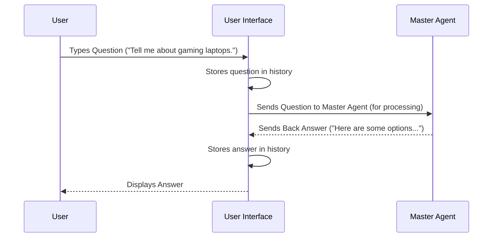

# Chapter 1: User Interface (Dashboard)

Welcome to the first chapter of the EggHatch AI tutorial! We're going to start with the part you'll see and interact with directly: the User Interface, also called the Dashboard.

Think of the User Interface (UI) as the "face" of our EggHatch AI project. It's the part where *you*, the user, can talk to the AI and see its responses.

## Why Do We Need a User Interface?

Imagine you have a super-smart robot (that's EggHatch AI!). How do you tell it what you want? How does it tell you its answer? You need a way to communicate! The User Interface is that communication channel.

**Our main use case:** You want to ask EggHatch AI a question about PC parts, like "What's a good gaming laptop for under $1500?". The UI makes this possible.

Without a UI, all the clever parts of EggHatch AI would just be code running in the background, with no way for a person to use them. The UI takes your question and shows you the answer, making the whole system useful!

## What Does the User Interface Do?

The User Interface for EggHatch AI does a few main things:

1.  **Takes your question:** It provides a place for you to type what you want to ask.
2.  **Sends your question:** When you hit "Send," it packages up your question and sends it to the "brain" of EggHatch AI (which we'll learn about in the next chapter, the [Master Agent](02_master_agent__orchestrator__.md)).
3.  **Receives the answer:** It waits for the answer to come back from the brain.
4.  **Displays the answer:** It shows you the response you got.
5.  **Shows the conversation history:** It remembers previous questions and answers so you can see the flow of your chat.

## How to Use the User Interface

Using the EggHatch AI User Interface is just like using any chat application.

1.  You open the `dashboard_app.py` file (which we'll run later).
2.  You'll see a text box. This is where you **type your question**.
3.  You click the **"Send" button**.
4.  The interface shows that it's "thinking..."
5.  The interface displays the **answer** it gets back.
6.  Your question and the AI's answer are added to the **chat history** above the text box.

For example, you might type: "What's a good budget gaming PC build?" and click Send. The UI handles everything from there to get you the answer.

## Under the Hood: How the UI Works

So, what happens when you type your question and click "Send"? It's like handing your question to a friendly assistant who then takes it to the main expert (the [Master Agent](02_master_agent__orchestrator__.md)) to get the answer.

Here’s a simple diagram showing the flow:



The User Interface's main job is to be the bridge between you and the rest of the EggHatch AI system.

## Peeking at the Code (`dashboard_app.py`)

Let's look at some very simplified parts of the `dashboard_app.py` file to see how it does this. This file uses a tool called Streamlit to quickly create web-based UIs.

First, we set up the page title and add some welcoming text:

```python
import streamlit as st

# Set page configuration
st.set_page_config(
    page_title="EggHatch AI", # The text in the browser tab
    page_icon="🐣", # The little icon
    layout="wide" # How the page is arranged
)

# Add a main heading
st.markdown("<h1 class='main-header'>🐣 EggHatch AI</h1>", unsafe_allow_html=True)
# Add a sub-heading
st.markdown("<h2 class='sub-header'>Your next tech upgrade is about to hatch</h2>", unsafe_allow_html=True)

# ... rest of the app setup ...
```

This code uses Streamlit's functions (`st.set_page_config`, `st.markdown`) to put the title and headings on the web page. The `st.markdown` allows us to use HTML and CSS for styling (like colors and sizes), making it look nice!

Next, the UI needs a place for you to type:

```python
# ... previous code ...

from app.master_agent import process_query # We'll use this later!

# Chat input area
with st.form(key="chat_form", clear_on_submit=True):
    user_input = st.text_area("Ask about PC builds, components, or tech gear:", height=100) # This is the text box
    submit_button = st.form_submit_button("Send") # This is the button

    if submit_button and user_input:
        # Code to handle the input goes here...
        pass # We'll add the handling code next

# ... rest of the app ...
```

Here, `st.text_area` creates the multi-line box for your question, and `st.form_submit_button` creates the "Send" button. The `with st.form(...)` groups them together so clicking "Send" submits the text box content.

Now, let's look at what happens when you click "Send". The UI needs to remember what you said, send it, and then remember the answer. Streamlit uses `st.session_state` to remember things between interactions (like your chat history).

```python
# ... previous code ...

# Initialize session state for chat history
if "messages" not in st.session_state:
    st.session_state.messages = [] # Start with an empty list for messages

# ... chat input form code ...

    if submit_button and user_input:
        # Add user message to chat history
        st.session_state.messages.append({"role": "user", "content": user_input}) # Add user's question

        # ... code to get and display response ...

        # Get response from agent
        # This is where we call the brain!
        response_data = process_query(user_input, thread_id=st.session_state.thread_id)

        # Extract the actual text response
        response = response_data.get('response', 'Sorry, I couldn\'t process that.')

        # Add assistant message to chat history
        st.session_state.messages.append({"role": "assistant", "content": response}) # Add AI's answer

        # Rerun to update the UI and show new messages
        st.rerun()

# ... code to display history ...
```

When you click "Send":
1.  The `user_input` is taken from the text box.
2.  It's added to the `st.session_state.messages` list, marked as a "user" message.
3.  Crucially, `process_query(user_input, ...)` is called. This function isn't part of the UI itself; it's how the UI *talks* to the [Master Agent](02_master_agent__orchestrator__.md) (which handles processing the query).
4.  The response received from `process_query` is then added to the `st.session_state.messages` list, marked as an "assistant" message.
5.  `st.rerun()` tells Streamlit to refresh the page, running the script again from the top but keeping the `st.session_state`. This redraws the page *with* the new messages in the history.

Finally, the UI needs to show the conversation history stored in `st.session_state.messages`:

```python
# ... previous code ...

# Display chat history
for message in st.session_state.messages:
    role = message["role"]
    content = message["content"]

    # Use different styling for user and assistant messages
    if role == "user":
        st.markdown(f"<div class='chat-message user-message'><b>You:</b> {content}</div>", unsafe_allow_html=True)
    else:
        st.markdown(f"<div class='chat-message assistant-message'><b>EggHatch AI:</b> {content}</div>", unsafe_allow_html=True)

# ... chat input form code ...
```

This code loops through all the messages stored in `st.session_state.messages` and displays them one by one, using different styles (`user-message` or `assistant-message` CSS classes, which are defined elsewhere in the code) to make it clear who said what.

You can see how the UI is relatively simple: it gets input, calls another part of the system ([Master Agent](02_master_agent__orchestrator__.md)), and displays the output. It's the welcoming front door for our AI!

*(Note: The actual `dashboard_app.py` code includes more details like managing the conversation thread ID for context, simulating streaming output, and adding a sidebar with settings and examples. We simplified it here to focus on the core input/output/display loop.)*

## Conclusion

In this chapter, we learned that the User Interface (Dashboard) is the part of EggHatch AI that users directly interact with. It's responsible for:
*   Getting questions from the user.
*   Sending those questions to the system's "brain".
*   Receiving answers back.
*   Displaying the answers and the conversation history in a user-friendly way.
*   Acting as the public face of the entire EggHatch AI system.

It handles the communication layer so the user doesn't need to worry about how the AI processes the information.

But where do those questions *go* after the UI sends them? That's handled by the [Master Agent](02_master_agent__orchestrator__.md), which we'll explore in the next chapter!

[Next Chapter: Master Agent (Orchestrator)](02_master_agent__orchestrator__.md)

---

Generated by [AI Codebase Knowledge Builder](https://github.com/The-Pocket/Tutorial-Codebase-Knowledge)