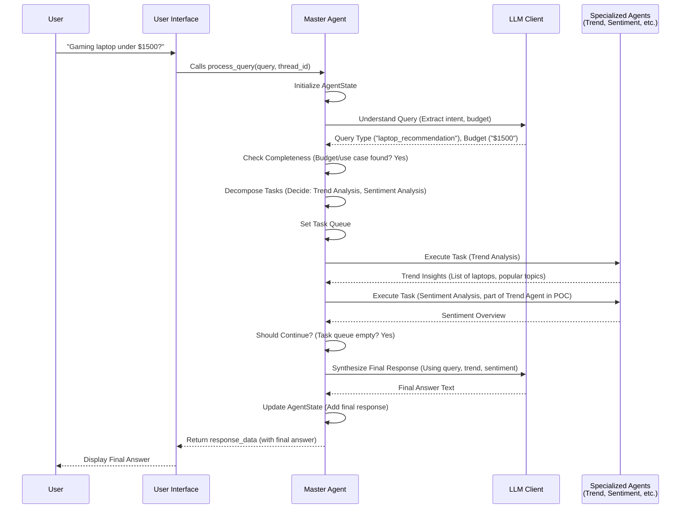

# Chapter 2: Master Agent (Orchestrator)

Welcome back to the EggHatch AI tutorial! In the last chapter, [User Interface (Dashboard)]({{ site.baseurl }}/01_user_interface__dashboard__.html), we saw how you, the user, interact with EggHatch AI – typing questions into the Dashboard and seeing the answers appear. The User Interface is like the friendly front door.

But once you've handed your question through that front door, where does it go? And who figures out what to *do* with it? That's the job of the **Master Agent**, also known as the **Orchestrator**.

## What is the Master Agent?

Think of the Master Agent as the **brain** or the **project manager** of EggHatch AI. When a question comes in from the User Interface, the Master Agent takes charge. It's responsible for:

1.  **Understanding** exactly what you're asking.
2.  Figuring out the best **plan** to answer your question.
3.  Sending different parts of the problem to the right **specialist agents** (like an agent that knows about trends or one that analyzes feelings).
4.  Making sure those specialist agents do their jobs in the correct **order**.
5.  Taking all the results from the specialists and **combining** them into one helpful final answer.
6.  Sending that final answer back to the User Interface to show you.

Without the Master Agent, the different parts of EggHatch AI wouldn't know how to work together to solve your request. It's the central coordinator making everything happen smoothly!

## The Use Case: Your Gaming Laptop Question

Let's stick with our example: You ask EggHatch AI, "What's a good gaming laptop for under $1500?".

Here's what the Master Agent needs to do with this simple question:

*   It needs to realize you're asking for a **laptop recommendation**.
*   It needs to note the **budget** ($1500).
*   It needs to understand the **use case** (gaming).
*   Based on this, it decides it might need to find **current trends** in gaming laptops and see what people generally feel about them (**sentiment**).
*   It sends requests to the agents that can do **Trend Analysis** and **Sentiment Analysis**.
*   Once it gets the information back (maybe a list of popular laptops and summaries of reviews), it uses this to build a helpful answer for you.

This whole process of understanding, planning, executing, and synthesizing is managed by the Master Agent.

## How the Master Agent Works (The Flow)

The Master Agent uses something called a **State Graph** (specifically, we use a library called LangGraph) to define its workflow. Think of a State Graph like a flowchart or a recipe. It defines a series of steps and how the agent moves from one step to the next based on the situation.

Here are the main steps (or "nodes" in LangGraph terms) in our Master Agent's flow:

1.  **Initialize State:** Start with a blank slate, just remembering the user's question.
2.  **Understand Query:** Figure out the user's intent, extract things like budget, use case, etc. It might decide if the query is too vague or out of scope.
3.  **Check Information Completeness:** Based on the understanding, decide if more info (like budget or use case) is needed before proceeding. If so, it might ask the user another question (returning a response immediately).
4.  **Decompose Tasks:** If enough info is available, break down the request into smaller tasks (like "run trend analysis," "run sentiment analysis"). This creates a list of tasks to do.
5.  **Execute Current Task:** Take the first task from the list and run the specialized agent responsible for it.
6.  **Should Continue Tasks:** Check if there are more tasks left in the list. If yes, go back to `Execute Current Task`. If no, move on.
7.  **Synthesize Response:** Once all tasks are done, gather the results from each task and use them to build the final, helpful answer.
8.  **END:** The process finishes, and the final answer is ready to be sent back.

This flow ensures that every query goes through the necessary steps to get the best possible answer.

## The Agent's "Memory" - Agent State

As the Master Agent moves through these steps, it needs to remember things: the original query, the extracted budget, the results from the Trend Analysis Agent, etc. This temporary "memory" or "scratchpad" is called the **Agent State**.

We'll dive deeper into the Agent State in a dedicated chapter ([Agent State]({{ site.baseurl }}/07_agent_state_.html)), but for now, just know that the Master Agent passes this `AgentState` object (which is like a structured container for information) from one step to the next, adding or updating information along the way.

## How the UI Uses the Master Agent

From the perspective of the User Interface, using the Master Agent is very simple. Remember in Chapter 1, we saw this line in `dashboard_app.py`?

```python
# ... from dashboard_app.py ...
from app.master_agent import process_query # We'll use this later!

# ... later in the code ...
if submit_button and user_input:
    # ... add user message to history ...

    # This is where we call the brain!
    response_data = process_query(user_input, thread_id=st.session_state.thread_id)

    # Extract the actual text response
    response = response_data.get('response', 'Sorry, I couldn\'t process that.')

    # ... add assistant message to history and rerun ...
```

This snippet shows that the UI just needs to call one function: `process_query`.

*   `process_query` takes the `user_input` (your question) and a `thread_id` (to keep track of the conversation history, like remembering previous turns).
*   It returns a dictionary called `response_data`. This dictionary contains the final answer in the `"response"` key, plus other potentially useful information like the insights gathered.

The UI doesn't need to know *how* `process_query` works internally; it just knows that it sends a question and gets an answer back.

## Under the Hood: Inside `app/master_agent.py`

Let's peek inside the `app/master_agent.py` file to see how this "brain" is built using LangGraph.

### The State Definition

First, the file defines the `AgentState` using a tool called Pydantic. This makes sure the "memory" always has a clear structure.

```python
# ... from app/master_agent.py ...
from pydantic import BaseModel, Field
from typing import Dict, List, Optional, Union, Any

# Define state schema
class AgentState(BaseModel):
    """State for the EggHatch AI agent."""

    # User interaction
    user_query: str = Field(default="")
    # ... other fields like budget, use_case, task_queue, results ...
    final_response: str = Field(default="")

# ... rest of the file ...
```

This code snippet shows that `AgentState` is a class that lists all the pieces of information the agent needs to track, like `user_query` and `final_response`. We'll learn more about this in [Agent State]({{ site.baseurl }}/07_agent_state_.html).

### The Nodes (The Steps)

Then, the file defines functions for each step in the process (the "nodes"). Each function takes the current `state` (or a dictionary representing it) and performs a specific action, returning a dictionary with the fields that should be updated in the state.

For example, here's a *very simplified* idea of the `understand_query` function:

```python
# ... from app/master_agent.py ...
def understand_query(state):
    """
    Understand the user query and extract relevant information.
    """
    # Use an LLM (Large Language Model) to figure things out
    # (We'll learn about LLMs in the next chapter!)
    # llm_client.generate(...) # <-- This happens inside

    # Imagine the LLM response says: "query_type: laptop_recommendation, budget: $1500"

    # Return a dictionary with the fields to update in the state
    return {
        "query_type": "laptop_recommendation",
        "budget": "$1500",
        "is_in_scope": True # Assume it's in scope for this example
    }

# ... other node functions like decompose_tasks, execute_current_task, synthesize_response ...
```

Each function (node) focuses on just one part of the job, making the system easier to build and understand.

### The Graph (The Flowchart)

Finally, LangGraph is used to define how these nodes are connected and how the `AgentState` flows between them.

```python
# ... from app/master_agent.py ...
from langgraph.graph import StateGraph, END

# Create the graph
def create_agent_graph() -> StateGraph:
    graph = StateGraph(AgentState)

    # Add the nodes (the functions we defined)
    graph.add_node("understand_query", understand_query)
    graph.add_node("decompose_tasks", decompose_tasks)
    # ... add other nodes ...
    graph.add_node("synthesize_response", synthesize_response)

    # Define the flow between nodes (the arrows in the flowchart)
    # After understanding the query, check if info is complete
    graph.add_conditional_edges(
        "understand_query",
        check_information_completeness, # <-- This function decides where to go next
        {
            "decompose_tasks": "decompose_tasks", # if complete, go here
            "ask_for_budget": "ask_for_budget",   # if need budget, go here
            # ... other conditions ...
        }
    )

    # After executing a task, decide if there are more tasks or time to synthesize
    graph.add_conditional_edges(
        "execute_current_task",
        should_continue_tasks, # <-- This function decides
        {
            "execute_current_task": "execute_current_task", # if more tasks, loop back
            "synthesize_response": "synthesize_response"   # if done, go here
        }
    )

    # When done synthesizing or asking for info, end the process
    graph.add_edge("synthesize_response", END)
    graph.add_edge("ask_for_budget", END) # Example: If we ask for budget, we end for now

    # Set the starting point
    graph.set_entry_point("understand_query") # Simplified entry

    return graph

# Compile the graph into a runnable agent
agent_graph = create_agent_graph()
agent = agent_graph.compile()

# ... process_query function uses agent.invoke(initial_state) ...
```

This code sets up the workflow. It says, "Start with `understand_query`. Then, based on `check_information_completeness`, go to `decompose_tasks` or `ask_for_budget` (and end if asking for info). Once tasks are decomposed, execute them. Keep executing tasks as long as `should_continue_tasks` says there are more. When done executing tasks, go to `synthesize_response`, and then `END`."

This structure makes the Master Agent powerful and flexible. It can handle different types of queries by following different paths through the graph and calling different specialist agents as needed.

### The Journey of a Query Visualized

Here's a simplified look at how a query travels through the Master Agent's workflow, interacting with other components:



This diagram shows how the Master Agent coordinates the flow, involving the [LLM Client]({{ site.baseurl }}/03_llm_client_.html) for understanding and synthesis, and the specialized agents for specific analysis tasks.

## Conclusion

In this chapter, we've seen that the Master Agent is the central control unit of EggHatch AI. It takes your question from the User Interface, understands your needs, plans and executes the necessary steps using a State Graph (flowchart), involving other specialist agents and the LLM, and finally crafts the complete answer before sending it back. It's the project manager making sure the right things happen in the right order.

We briefly touched on the role of the **LLM (Large Language Model)**, which helps the Master Agent understand queries and synthesize responses. In the next chapter, we'll take a closer look at the [LLM Client]({{ site.baseurl }}/03_llm_client_.html) and how EggHatch AI interacts with powerful AI models.

[Next Chapter: LLM Client]({{ site.baseurl }}/03_llm_client_.html)

---

Generated by [AI Codebase Knowledge Builder](https://github.com/The-Pocket/Tutorial-Codebase-Knowledge)