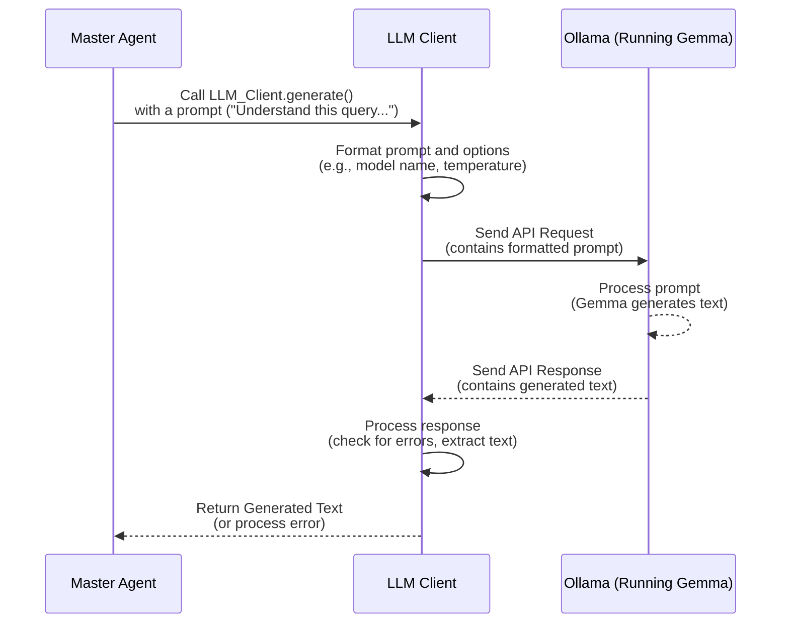

# Chapter 3: LLM Client

Welcome back to the EggHatch AI tutorial! In the last chapter, [Master Agent (Orchestrator)](02_master_agent__orchestrator__.md), we learned that the Master Agent is the "brain" or "project manager" that takes your question and figures out the steps needed to answer it. It decides *what* needs to be done.

But how does the Master Agent actually *talk* to the AI itself? How does it send those instructions or prompts and get text back? That's where the **LLM Client** comes in.

## What is the LLM Client?

Think of the LLM Client as the **dedicated messenger service** for the EggHatch AI system. Its *only* job is to handle talking to the **Large Language Model (LLM)**.

The LLM is the actual AI model (in our case, Gemma running through Ollama) that can understand language, generate text, and perform complex reasoning tasks. It's the expert that provides the raw intelligence.

The LLM Client is the specialized tool that allows other parts of our system, like the [Master Agent](02_master_agent__orchestrator__.md), to send messages (prompts) to the LLM and receive the AI's generated text replies.

## Why Do We Need an LLM Client?

We need the LLM Client because talking to an AI model isn't always as simple as sending a text message. AI models often run as separate services (like Ollama), and interacting with them requires specific technical steps:

*   Knowing the correct web address (URL) to send requests to.
*   Formatting the request correctly (e.g., putting the prompt in the right place).
*   Handling potential network issues or errors.
*   Sometimes, managing settings like how creative or how long the AI's response should be.

The LLM Client hides all these technical details. Other parts of EggHatch AI don't need to know *how* to talk to Ollama; they just tell the LLM Client, "Here's a prompt, go ask the AI and get the answer." The LLM Client does the heavy lifting.

## The Use Case: Asking the AI a Question

Let's go back to our example query: "What's a good gaming laptop for under $1500?".

When the [Master Agent](02_master_agent__orchestrator__.md) receives this, one of the first things it needs to do is **understand** the query. It needs to ask the LLM: "Hey AI, figure out what the user is asking for (query type), their budget, and their main use case from this text: 'What's a good gaming laptop for under $1500?'".

Later, after gathering information, the Master Agent needs to **synthesize** the final answer. It needs to ask the LLM again: "Hey AI, take the user's original query and these analysis results, and write a helpful recommendation."

In both these steps, the Master Agent relies entirely on the LLM Client to communicate with the AI model and get the necessary text back.

## How the LLM Client Works (High Level)

Here's a simple flow showing how a part of the system (like the Master Agent) uses the LLM Client to talk to the AI:



As you can see, the LLM Client acts as the intermediary, translating the request from the Master Agent into something the Ollama service understands and translating the response back.

## Under the Hood: Inside `app/llm_integrations.py`

The code for the LLM Client lives in `app/llm_integrations.py`. Let's look at the key parts.

### The `OllamaClient` Class

This file defines a class called `OllamaClient`. A "class" is like a blueprint for creating objects. The `OllamaClient` blueprint defines everything our messenger object needs: where to send messages, how to format them, and how to handle replies.

```python
# ... from app/llm_integrations.py ...
import os
import json
import time
# ... other imports ...
import requests
from requests.adapters import HTTPAdapter
from urllib3.util.retry import Retry
from dotenv import load_dotenv

# Load environment variables (like the Ollama URL and model name)
load_dotenv()

class OllamaClient:
    """Client for interacting with Ollama API."""

    def __init__(self,
                base_url: str = os.getenv("OLLAMA_BASE_URL", "http://localhost:11434"),
                model: str = os.getenv("OLLAMA_MODEL", "gemma3:12b"),
                max_retries: int = int(os.getenv("MAX_RETRIES", "3")),
                retry_delay: float = float(os.getenv("RETRY_DELAY", "1.0"))):
        """
        Initialize the Ollama client.
        """
        self.base_url = base_url # Where Ollama is running
        self.model = model       # Which AI model to use (Gemma 3 12B)
        self.generate_endpoint = f"{base_url}/api/generate" # Specific URL for text generation
        self.chat_endpoint = f"{base_url}/api/chat"     # Specific URL for chat conversations

        # Configure retry strategy - handles network issues
        retry_strategy = Retry(
            total=max_retries,
            backoff_factor=retry_delay,
            status_forcelist=[429, 500, 502, 503, 504]
        )
        self.session = requests.Session() # Tool for making web requests
        adapter = HTTPAdapter(max_retries=retry_strategy)
        self.session.mount("http://", adapter)
        self.session.mount("https://", adapter)

# ... rest of the class ...
```

The `__init__` method runs when you create an `OllamaClient` object. It sets up essential information like the address (`base_url`) and the name of the AI model (`model`) we want to use. It also configures a "retry strategy" using the `requests` library – this means if the first attempt to talk to Ollama fails (maybe it's temporarily busy), the client will automatically try again a few times before giving up, making our system more robust!

### Sending a Prompt (`generate` method)

The main way other parts of the system use the LLM Client is by calling methods like `generate` or `chat_completion`. These methods take the information needed for the AI (like the prompt) and handle sending it.

Here's a simplified look at the `generate` method:

```python
# ... inside the OllamaClient class ...

    def generate(self,
                prompt: str,
                system_prompt: Optional[str] = None,
                temperature: float = float(os.getenv("TEMPERATURE", "0.7")),
                max_tokens: int = int(os.getenv("MAX_TOKENS", "4096")),
                stream: bool = True) -> Union[Dict[str, Any], Generator[Dict[str, Any], None, None]]:
        """
        Generate text using the Ollama API.
        """
        payload = { # This dictionary is what we send to Ollama
            "model": self.model,
            "prompt": prompt,
            "system": system_prompt, # Additional context for the AI
            "temperature": temperature, # How creative the AI should be
            "max_tokens": max_tokens, # Maximum length of the response
            "stream": stream          # Get response piece by piece?
        }

        if stream:
            # If streaming, return a generator that yields chunks
            return self._stream_response(self.generate_endpoint, payload)
        else:
            # If not streaming, wait for the full response
            response = self._make_request(self.generate_endpoint, payload)
            # Package the response nicely
            return OllamaResponse(**response).dict()

# ... rest of the class ...
```

The `generate` method takes your `prompt` (the question or instruction for the AI). It also accepts optional settings like `temperature` (which affects how "creative" or "random" the AI's text is – higher values mean more creative, lower values mean more focused). It builds a `payload` dictionary containing all this information in the format Ollama expects. Then, it calls a helper method (`_make_request` or `_stream_response`) to actually send this `payload` over the internet to Ollama and handles getting the response back.

### Handling the Communication (`_make_request` method)

The `_make_request` method is where the actual talking to Ollama happens. It uses the `requests` library (a popular tool for making web requests in Python) to send the formatted `payload` to the correct endpoint (like `/api/generate`).

```python
# ... inside the OllamaClient class ...

    def _make_request(self, endpoint: str, payload: Dict[str, Any]) -> Dict[str, Any]:
        """
        Make a request to the Ollama API with retry logic.
        """
        try:
            # Send the POST request with the payload
            response = self.session.post(endpoint, json=payload)
            # Check if the request was successful (status code 200-299)
            response.raise_for_status()
            # If successful, parse the JSON response from Ollama
            return response.json()
        except requests.exceptions.RequestException as e:
            # If an error occurs (after retries), print it
            print(f"Error calling Ollama API: {e}")
            # Return an error dictionary so the caller knows something went wrong
            return {"error": str(e)}

# ... rest of the class ...
```

This method is crucial. It uses the `self.session` (which has the retry logic configured) to send the request. `response.raise_for_status()` automatically checks if the server responded with an error (like 404 Not Found or 500 Internal Server Error) and raises an exception if it did, which our `try...except` block catches. If everything goes well, it parses the JSON data returned by Ollama and gives it back.

### Streaming Responses (`_stream_response` method)

AI models can sometimes take a while to generate a full response. To make the User Interface feel more responsive, we can ask the LLM to "stream" the response, meaning it sends back the text little by little as it's generated, rather than waiting for the whole thing. The `_stream_response` method handles this:

```python
# ... inside the OllamaClient class ...

    def _stream_response(self, endpoint: str, payload: Dict[str, Any]) -> Generator[Dict[str, Any], None, None]:
        """
        Stream responses from the Ollama API.
        """
        try:
            # Send the request with stream=True
            with self.session.post(endpoint, json=payload, stream=True) as response:
                response.raise_for_status()
                # Read the response line by line as it comes in
                for line in response.iter_lines():
                    if line:
                        try:
                            # Each line is a JSON object (a "chunk")
                            chunk = json.loads(line)
                            # Yield (give back) this chunk
                            yield OllamaResponse(**chunk).dict()
                        except json.JSONDecodeError as e:
                            print(f"Error decoding stream chunk: {e}")
                            continue
        except requests.exceptions.RequestException as e:
            print(f"Error streaming from Ollama API: {e}")
            yield {"error": str(e)} # Yield an error chunk if request fails
```

This method sets `stream=True` in the request. It then loops through the incoming response line by line. Each line is expected to be a small piece of JSON data representing a "chunk" of the AI's response. The `yield` keyword is special in Python; it means this function is a "generator" that gives back one chunk at a time without stopping the whole process, allowing the caller to process the response as it arrives.

## How the Master Agent Uses the LLM Client

As we saw in Chapter 2, the [Master Agent (Orchestrator)](02_master_agent__orchestrator__.md) interacts with the LLM Client through the `llm_client` object which is created at the top of `app/master_agent.py`:

```python
# ... from app/master_agent.py ...
# ... imports ...
from app.llm_integrations import OllamaClient
# ... other code ...

# Initialize LLM client - This creates the messenger object!
llm_client = OllamaClient()

# ... rest of the code ...
```

Then, inside the Master Agent's nodes (the functions that perform steps), the `llm_client` object's methods are called. For example, in the `understand_query` node:

```python
# ... inside app/master_agent.py, in the understand_query function ...

    # Call the LLM using the llm_client object's generate method
    response_generator = llm_client.generate(
        prompt=QUERY_UNDERSTANDING_PROMPT.format(user_query=state.user_query),
        system_prompt=MASTER_AGENT_SYSTEM_PROMPT
    )
    # Collect the full streamed response
    response = collect_streaming_response(response_generator)

    # ... process the response ...

    # Return updated state...
    # return updated_fields
```

The `understand_query` function simply calls `llm_client.generate()`, passing it the specific `prompt` needed to understand the user's question and a `system_prompt` to give the AI context about its role. It receives the AI's response back (after collecting the streamed output) and then continues its own logic (parsing the response, updating the state, etc.). It doesn't care *how* the message got to the AI or *how* the reply came back; it just trusts the `llm_client` to handle the communication.

This separation of concerns is important! The LLM Client focuses only on talking to the AI, while the [Master Agent](02_master_agent__orchestrator__.md) focuses only on orchestrating the overall workflow.

## Conclusion

In this chapter, we've explored the role of the LLM Client as the crucial messenger service for EggHatch AI. We learned that it:

*   Handles all the technical details of communicating with the Large Language Model (Gemma via Ollama).
*   Allows other parts of the system, like the [Master Agent](02_master_agent__orchestrator__.md), to easily send prompts and receive AI-generated text.
*   Manages connections, errors, retries, and can handle streaming responses for a better user experience.

It provides the vital link between our system's logic and the powerful AI model that forms its intelligence core.

Now that we know how the Master Agent talks to the AI, what about the data the AI needs to analyze? For our PC part use case, we need data about products! That's handled by the [Data Pipeline](04_data_pipeline_.md), which we'll dive into in the next chapter.

[Next Chapter: Data Pipeline](04_data_pipeline_.md)

---

Generated by [AI Codebase Knowledge Builder](https://github.com/The-Pocket/Tutorial-Codebase-Knowledge)
