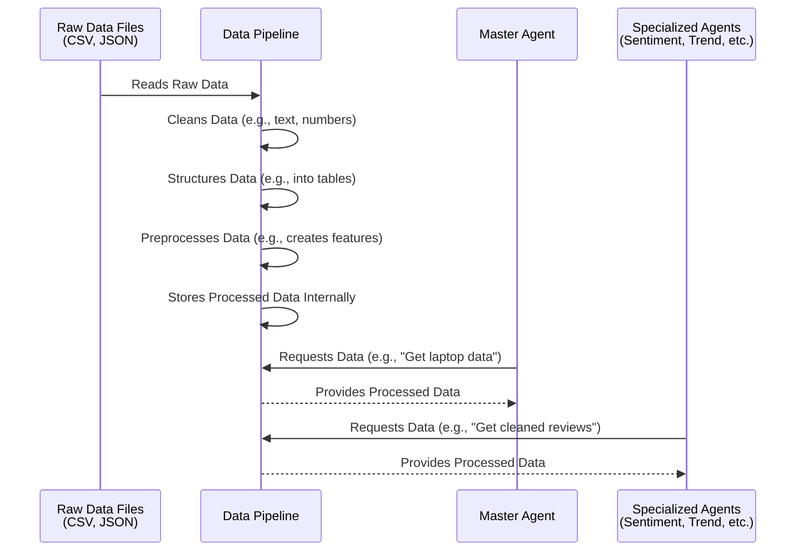

# Chapter 4: Data Pipeline

Welcome back to the EggHatch AI tutorial! In the last chapter, [LLM Client](03_llm_client_.md), we learned how our system talks to the powerful AI model itself. The LLM Client is the messenger that sends instructions (prompts) and gets text back.

But what does the AI *talk about*? For EggHatch AI to give you helpful advice on PC parts and tech, it needs information about products – like laptop specifications, prices, and what real customers think about them. This is where the **Data Pipeline** comes in.

## What is the Data Pipeline?

Imagine the Data Pipeline is like the **prep station in a busy kitchen**. Raw ingredients (our raw data like messy spreadsheets or text files of reviews) arrive here. The kitchen staff (the Data Pipeline) then washes, chops, measures, and prepares everything so it's ready for the chefs (the other agents) to use in their dishes (the final recommendations and analysis).

Its main job is to take raw, potentially messy data and transform it into a clean, structured format that the rest of the EggHatch AI system can easily understand and work with.

## Why Do We Need a Data Pipeline?

Raw data is rarely perfect. It can have:

*   **Inconsistencies:** Prices might be formatted differently, names might be spelled slightly wrong.
*   **Missing information:** Some entries might not have a rating or a specific spec.
*   **Noise:** Extra spaces, special characters, or irrelevant text in reviews.
*   **Unstructured formats:** Reviews are just blocks of text, not neatly organized tables.

If our agents tried to work directly with this messy data, they would get confused, produce inaccurate results, or even fail completely. The Data Pipeline ensures that **all agents get consistent, high-quality data** to perform their specific tasks.

## The Use Case: Providing Data for Analysis

Let's go back to our example: You ask, "What's a good gaming laptop for under $1500?".

To answer this, the [Master Agent](02_master_agent__orchestrator__.md) might need to:

1.  Find a list of laptops with their specs and prices.
2.  Analyze customer reviews to understand their feelings (positive/negative) about specific models or features.
3.  Look at overall trends in reviews (e.g., are people complaining about battery life on recent models?).

All the data needed for these steps – the list of laptops, their prices, the review texts, the review ratings – comes from the Data Pipeline. The [Master Agent](02_master_agent__orchestrator__.md) and the specialized agents ([Sentiment Analysis Agent](05_sentiment_analysis_agent_.md), [Trend Analysis Agent](06_trend_analysis_agent_.md)) *request* the data they need from the Data Pipeline, which provides it in a clean, ready-to-use format.

## What Does the Data Pipeline Do?

The Data Pipeline in EggHatch AI performs several key steps:

1.  **Load Data:** Read the initial data files (like a CSV of laptop specs and JSON files containing reviews).
2.  **Extract Information:** Pull out relevant pieces of data from the raw sources (e.g., the text of a review, the rating number, the price).
3.  **Clean Data:** Remove inconsistencies, fix errors, and normalize text (like converting everything to lowercase).
4.  **Structure Data:** Organize the extracted and cleaned information into easy-to-use formats, like lists of dictionaries or tables (Pandas DataFrames).
5.  **Preprocess Data:** Perform transformations needed for analysis, such as converting text features into numerical values (like turning "i7 Processor" into a "processor tier" score), handling missing values, or preparing text for language models.
6.  **Provide Data:** Offer methods for other parts of the system to access the processed data (e.g., "give me all cleaned reviews," "give me the laptop data table").

## How the Data Pipeline Works (High-Level Flow)

Here's a simplified flow of how data moves through the pipeline:



The Data Pipeline acts as a central data preparation service. It does its processing once (usually when it's initialized) and then serves the clean data to anyone who asks for it.

## Under the Hood: Inside `app/agents/data_pipeline.py`

Let's peek into the code file `app/agents/data_pipeline.py` to see how this kitchen prep station is built.

The core of the Data Pipeline is the `DataPipeline` class. When an instance of this class is created, it immediately starts loading and processing the data.

```python
# ... from app/agents/data_pipeline.py ...
import os
import json
import pandas as pd
from pathlib import Path
# ... other imports and setup ...

# Constants defining where data files are
DATA_DIR = Path("data")
CSV_DIR = DATA_DIR / "csv"
REVIEWS_DIR = DATA_DIR / "reviews"
LAPTOPS_CSV = CSV_DIR / "gaming_laptops_with_reviews.csv"

class DataPipeline:
    """Handles data loading and preprocessing for analysis."""

    def __init__(self):
        self.laptop_data = None # Will store the laptop table
        self.reviews_data = {} # Will store raw reviews data
        self.processed_reviews = [] # Will store cleaned, structured reviews
        self.review_texts = [] # Will store just the cleaned text
        self.preprocessed_data = None # Will store preprocessed laptop table

        # Initialize by loading the data
        self._load_data() # This calls the main loading function

# ... rest of the class methods ...
```

When you create a `DataPipeline` object (`pipeline = DataPipeline()`), its `__init__` method runs. This method sets up some variables to hold the data and immediately calls `self._load_data()`.

### Loading the Data

The `_load_data` method reads the data files from disk.

```python
# ... inside the DataPipeline class ...

    def _load_data(self):
        """Load laptop and review data."""
        try:
            # Load the main laptop CSV file into a pandas DataFrame (a table)
            self.laptop_data = pd.read_csv(LAPTOPS_CSV)
            logger.info(f"Loaded {len(self.laptop_data)} laptops from {LAPTOPS_CSV}")

            # Loop through each laptop entry
            for _, row in self.laptop_data.iterrows():
                # If there's a path listed for reviews for this laptop
                if pd.notna(row.get('reviews')):
                    review_path = row['reviews']
                    try:
                        # Open and read the JSON file containing reviews
                        with open(review_path, 'r', encoding='utf-8') as f:
                            self.reviews_data[review_path] = json.load(f)
                    except Exception as e:
                        logger.error(f"Error loading reviews from {review_path}: {str(e)}")

            logger.info(f"Loaded reviews for {len(self.reviews_data)} laptops")

            # Once loaded, immediately process the reviews
            self._process_reviews()

        except Exception as e:
            logger.error(f"Error loading data: {str(e)}")

# ... rest of the class methods ...
```

This code reads the main laptop data from the `gaming_laptops_with_reviews.csv` file into a Pandas DataFrame called `self.laptop_data`. It then looks at each row in that table; if a row points to a review file (like `data/reviews/laptop_a_reviews.json`), it opens and reads that JSON file and stores the contents in `self.reviews_data`. After loading, it calls `_process_reviews`.

### Cleaning and Processing Reviews

The `_process_reviews` method goes through all the raw reviews that were loaded and cleans them.

```python
# ... inside the DataPipeline class ...

    def _process_reviews(self):
        """Process and clean review data."""
        try:
            # Iterate through all the raw reviews loaded
            for laptop_id, reviews in self.reviews_data.items():
                for review in reviews:
                    # Get the review text and clean it
                    if 'text' in review and review['text']:
                        clean_text = self._clean_text(review['text']) # Calls the cleaning function

                        # Store the cleaned review with its metadata
                        self.processed_reviews.append({
                            'laptop_id': laptop_id,
                            'text': clean_text,
                            'rating': review.get('rating', None),
                            # ... other metadata like date, title ...
                        })

                        # Also store just the clean text in a separate list (useful for some agents)
                        if len(clean_text) > 20: # Skip very short/empty reviews
                            self.review_texts.append(clean_text)

            logger.info(f"Processed {len(self.processed_reviews)} reviews")

        except Exception as e:
            logger.error(f"Error processing reviews: {str(e)}")

# ... rest of the class methods ...
```

This function loops through the `self.reviews_data` (the raw data loaded from JSON files). For each review found, it calls the `_clean_text` function to get a cleaned version of the text. It then creates a new dictionary containing the cleaned text plus the original review's rating and other details, adding this to the `self.processed_reviews` list. It also adds just the cleaned text to `self.review_texts`.

The `_clean_text` function is simple but important:

```python
# ... inside the DataPipeline class ...

    def _clean_text(self, text: str) -> str:
        """Clean and normalize text."""
        if not text:
            return ""

        # Ensure it's a string
        if not isinstance(text, str):
            text = str(text)

        # Remove extra whitespace (turns "hello   world" into "hello world")
        text = ' '.join(text.split())

        # Convert everything to lowercase
        text = text.lower()

        # More advanced cleaning (like removing punctuation) could go here

        return text

# ... rest of the class methods ...
```

This function makes sure all review text is in a consistent format (lowercase, no extra spaces).

### Preprocessing Laptop Data

The `preprocess_data` method adds new, useful columns to the laptop table that can be better used by analysis agents.

```python
# ... inside the DataPipeline class ...

    def preprocess_data(self) -> pd.DataFrame:
        """Preprocess laptop data for modeling."""
        if self.laptop_data is None:
            logger.error("No laptop data available...")
            return pd.DataFrame()

        df = self.laptop_data.copy() # Work on a copy

        # Clean and create new features
        try:
            # Extract just the number from the rating string (e.g., "Rating + 4" -> 4.0)
            df['rating_value'] = df['rating'].str.extract(r'Rating \+ (\d+)').astype(float)

            # Extract display size as a number (e.g., "15.6\"" -> 15.6)
            df['display_size'] = df['display'].str.extract(r'(\d+\.?\d*)').astype(float)

            # Extract storage sizes and calculate total storage
            df['hdd_size'] = df['hdd'].str.extract(r'(\d+)').fillna(0).astype(float)
            df['ssd_size'] = df['ssd'].str.extract(r'(\d+)').fillna(0).astype(float)
            df['total_storage'] = df['hdd_size'] + df['ssd_size']

            # Create numerical "tiers" for processor and GPU based on name
            processor_tiers = {'i3': 1, 'i5': 2, 'i7': 3, 'i9': 4}
            df['processor_tier'] = df['processor'].map(processor_tiers).fillna(0).astype(int)
            df['gpu_tier'] = 0 # Simplified example
            df.loc[df['gpu'].str.contains('RTX', na=False), 'gpu_tier'] = 3
            # ... more complex GPU tier logic could be here ...

            self.preprocessed_data = df # Store the result
            logger.info("Data preprocessing completed successfully")
            return df

        except Exception as e:
            logger.error(f"Error preprocessing data: {str(e)}")
            return df

# ... rest of the class methods ...
```

This function takes the laptop DataFrame and adds new columns like `rating_value`, `display_size`, `total_storage`, `processor_tier`, and `gpu_tier`. These new columns turn text descriptions into numbers or categories that are easier for analysis algorithms (or even the LLM) to work with.

### Providing the Data

Finally, the `DataPipeline` class has simple methods to give other parts of the system access to the data once it's processed:

```python
# ... inside the DataPipeline class ...

    def get_laptop_data(self) -> pd.DataFrame:
        """Get laptop data as DataFrame."""
        # Returns the main laptop table (either raw or preprocessed depending on usage)
        return self.laptop_data # Or self.preprocessed_data if that's preferred

    def get_processed_reviews(self) -> List[Dict[str, Any]]:
        """Get processed reviews with metadata."""
        # Returns the list of cleaned reviews with their details
        return self.processed_reviews

    def get_review_texts(self) -> List[str]:
        """Get cleaned review texts for topic modeling."""
        # Returns just the list of cleaned text strings
        return self.review_texts

    def filter_reviews_by_query(self, query: str) -> List[Dict[str, Any]]:
        """Filter reviews by a search query."""
        # Example: returns only reviews that contain a specific word or phrase
        if not query:
            return self.processed_reviews # Return all if no query
        query_lower = query.lower()
        return [
            review for review in self.processed_reviews
            if query_lower in review['text'].lower()
        ]
# ... rest of the class methods ...
```

These methods allow the [Master Agent](02_master_agent__orchestrator__.md) or other agents to simply call `data_pipeline.get_processed_reviews()` or `data_pipeline.get_laptop_data()` to receive the data they need, already cleaned and structured. The `filter_reviews_by_query` method is a handy helper for finding reviews relevant to a specific search term.

## How Agents Use the Data Pipeline

When a specialized agent, like the one performing sentiment analysis, needs data, it doesn't open files itself. It interacts with an instance of the `DataPipeline` class.

For example, the [Sentiment Analysis Agent](05_sentiment_analysis_agent_.md) will likely need the list of processed reviews. It would get this by calling:

```python
# Imagine this code is inside a specialized agent
from app.agents.data_pipeline import get_data_pipeline

# Get the pipeline instance
data_pipeline = get_data_pipeline() # This function ensures only one pipeline instance is created

# Now get the data
reviews = data_pipeline.get_processed_reviews()

# Now the agent can work with the 'reviews' list...
# ... Analyze sentiment of each review in the 'reviews' list ...
```

The agent doesn't need to know *how* the reviews were loaded or cleaned, only that `get_processed_reviews()` will give it the data it needs in the expected format. This makes the agents simpler and keeps the data handling logic in one place.

## Conclusion

In this chapter, we've learned that the Data Pipeline is EggHatch AI's crucial data preparation component. It's like the kitchen's prep station, taking raw data ingredients (files on disk), cleaning and structuring them, and making them available in a consistent, easy-to-use format for the rest of the system. It handles loading, cleaning, and preprocessing so that specialized agents can focus on analysis without worrying about data messiness.

Now that we have our data cleaned and ready, we can start analyzing it! In the next chapter, we'll look at one of the specialized agents that uses this data: the [Sentiment Analysis Agent](05_sentiment_analysis_agent_.md), which figures out the feelings expressed in customer reviews.

[Next Chapter: Sentiment Analysis Agent](05_sentiment_analysis_agent_.md)

---

Generated by [AI Codebase Knowledge Builder](https://github.com/The-Pocket/Tutorial-Codebase-Knowledge)
