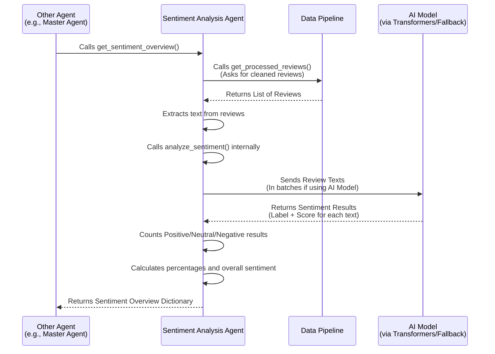

# Chapter 5: Sentiment Analysis Agent

Welcome back to the EggHatch AI tutorial! In the last chapter, [Data Pipeline](04_data_pipeline_.md), we learned how our system gathers, cleans, and prepares raw data, like customer reviews, making it ready for analysis.

Now that we have this clean data, what can we *do* with it? One very useful thing is to understand how people *feel* about the products they are reviewing. This is where the **Sentiment Analysis Agent** comes in.

## What is the Sentiment Analysis Agent?

Think of the Sentiment Analysis Agent as a **mood ring for text**. Its special job is to read a piece of text, like a customer review, and tell us the overall feeling or **sentiment** expressed in that text. Is the reviewer expressing a:

*   **Positive** feeling? (e.g., "This laptop is amazing!")
*   **Negative** feeling? (e.g., "Battery life is terrible.")
*   **Neutral** feeling? (e.g., "The box arrived today.")

This agent uses a special type of AI model (a pre-trained language model) that's good at understanding the nuances of human language to figure this out. It also has a simple backup plan (a rule-based fallback) in case the main AI model isn't available.

Knowing the sentiment of reviews is incredibly helpful! It tells us whether customers are generally happy or unhappy with a product or a specific feature.

## Why Do We Need a Sentiment Analysis Agent?

When you're looking at hundreds or thousands of reviews for a product, you can't possibly read them all yourself to get a sense of how people feel. You need an automated way to get an summary of the overall mood.

*   **For Users:** When you ask EggHatch AI for a recommendation, knowing the general sentiment from reviews helps the system tell you not just *what* the specs are, but also *how satisfied* users are.
*   **For Analysis:** Other agents (like the [Trend Analysis Agent](06_trend_analysis_agent_.md) we'll see later) might want to combine sentiment with other findings. For example, finding out that many people are talking about "battery life" AND the sentiment around those mentions is mostly "negative".

The Sentiment Analysis Agent provides this crucial emotional insight from the raw text data.

## The Use Case: Understanding Review Mood

Let's go back to our example: "What's a good gaming laptop for under $1500?".

If the [Master Agent](02_master_agent__orchestrator__.md) needs to figure out if a specific laptop model is well-liked within that budget, it can use the Sentiment Analysis Agent.

The process might look like this:

1.  The [Master Agent](02_master_agent__orchestrator__.md) identifies relevant laptops.
2.  It asks the [Data Pipeline](04_data_pipeline_.md) for all the customer reviews for those laptops.
3.  It gives these reviews to the Sentiment Analysis Agent.
4.  The Sentiment Analysis Agent analyzes each review individually.
5.  It then provides an *overall summary* back to the Master Agent, like "For Laptop X, 75% of reviews were positive, 10% neutral, and 15% negative."

This overview helps the [Master Agent](02_master_agent__orchestrator__.md) build a more complete picture for its recommendation.

## How to Use the Sentiment Analysis Agent

From the perspective of another agent (like the [Master Agent](02_master_agent__orchestrator__.md)), using the Sentiment Analysis Agent is straightforward. You interact with a `SentimentAnalyzer` object, typically obtained via a helper function to ensure you use the correct instance.

Here's how an agent might get the overall sentiment for all available reviews:

```python
# Imagine this code is inside another agent's function
from app.agents.sentiment_analysis import get_sentiment_analyzer

# 1. Get the Sentiment Analyzer instance
sentiment_analyzer = get_sentiment_analyzer()

# 2. Call the method to get an overview (it uses the Data Pipeline internally)
sentiment_overview = sentiment_analyzer.get_sentiment_overview()

# 3. The 'sentiment_overview' dictionary now holds the results!
print(sentiment_overview)
```

The `get_sentiment_analyzer()` function gives you access to the agent. You then call its `get_sentiment_overview()` method. You don't need to manually load reviews here; the `SentimentAnalyzer` object knows how to get them from the [Data Pipeline](04_data_pipeline_.md) itself!

The `sentiment_overview` dictionary will contain details like the count and percentage of positive, neutral, and negative reviews, plus an overall summary label like "Very Positive" or "Mixed".

You can also analyze sentiment for specific pieces of text if needed:

```python
# Using the same sentiment_analyzer object...

# A list of text strings you want to analyze
texts_to_check = [
    "The screen is vibrant, but the trackpad is awful.",
    "Just got it, seems okay.",
    "Best laptop I've ever owned!"
]

# Call the method to analyze sentiment for these specific texts
results = sentiment_analyzer.analyze_sentiment(texts_to_check)

# 'results' will be a list with a sentiment label and score for each text
print(results)
```

The `analyze_sentiment()` method takes a list of text strings and returns a list where each item tells you the sentiment (`positive`, `negative`, or `neutral`) and a confidence score for that text.

## How the Sentiment Analysis Agent Works (The Flow)

Here's a simple look at the steps when another agent asks for a sentiment overview:



The Sentiment Analysis Agent acts as a data processor. It gets the raw material (reviews) from the [Data Pipeline](04_data_pipeline_.md), runs its analysis (sentiment classification) using the AI model (or fallback), summarizes the findings, and provides the result.

## Under the Hood: Inside `app/agents/sentiment_analysis.py`

Let's open the `app/agents/sentiment_analysis.py` file to see how this agent is built.

The main component is the `SentimentAnalyzer` class.

### Setting up the Analyzer

The `__init__` method sets up the tools the agent will use:

```python
# ... inside app/agents/sentiment_analysis.py ...
from transformers import pipeline # Tool to easily use pre-trained models
from app.agents.data_pipeline import get_data_pipeline # To get data

# Name of the pre-trained AI model we want to use
SENTIMENT_MODEL = "distilbert-base-uncased-finetuned-sst-2-english"

class SentimentAnalyzer:
    def __init__(self):
        self.sentiment_analyzer = None # This will hold the AI model tool
        self.data_pipeline = None      # This will hold the Data Pipeline tool

        # Try to load the AI model
        self._initialize_sentiment_analyzer()

        # Get access to the Data Pipeline
        try:
            self.data_pipeline = get_data_pipeline()
            # logger.info(...) # Log success
        except Exception as e:
            # logger.error(...) # Log error
            pass # Data pipeline might not be critical for *all* methods

    def _initialize_sentiment_analyzer(self):
        """Initialize the sentiment analysis model."""
        try:
            # Use the 'pipeline' tool from transformers
            # This downloads the specified model if you don't have it
            self.sentiment_analyzer = pipeline(
                "sentiment-analysis",
                model=SENTIMENT_MODEL,
                return_all_scores=True # Get scores for both positive/negative
            )
            # logger.info(...) # Log success
        except Exception as e:
            # logger.error(...) # Log error
            # If AI model fails, self.sentiment_analyzer remains None,
            # triggering the fallback in analyze_sentiment.
            pass # Use simple fallback instead
```

The `__init__` function first tries to load the specified AI model (`SENTIMENT_MODEL`) using the `transformers` library's `pipeline` function. This tool makes it easy to use powerful models without needing to know complex details. If loading the model fails (e.g., no internet, model not found), `self.sentiment_analyzer` remains `None`. It also gets an instance of the `DataPipeline` using `get_data_pipeline()`.

### The Simple Fallback

If the AI model cannot be loaded, the agent uses a simple rule-based method:

```python
# ... inside the SentimentAnalyzer class ...

    def _simple_sentiment_analyzer(self, texts: List[str]) -> List[Dict[str, Any]]:
        """
        Simple rule-based sentiment analyzer as fallback.
        """
        results = []
        # Simple lists of words that suggest positive or negative sentiment
        positive_words = ['good', 'great', 'excellent', 'amazing', 'awesome', 'love', ...]
        negative_words = ['bad', 'poor', 'terrible', 'awful', 'issue', 'problem', ...]

        for text in texts:
            text_lower = text.lower()
            # Count how many positive/negative words appear
            pos_count = sum(1 for word in positive_words if word in text_lower)
            neg_count = sum(1 for word in negative_words if word in text_lower)

            # Basic logic to decide sentiment
            if pos_count > neg_count and pos_count > 0:
                 label = "POSITIVE"
                 score = 1.0 # Simplified score
            elif neg_count > pos_count and neg_count > 0:
                 label = "NEGATIVE"
                 score = 1.0 # Simplified score
            else:
                 label = "NEUTRAL"
                 score = 0.5 # Simplified score

            # Format the result similarly to the AI model output
            results.append([
                {"label": "NEGATIVE", "score": 1.0 - score},
                {"label": "POSITIVE", "score": score}
            ])

        return results
```

This method counts specific positive and negative words in the text. If there are more positive words, it's positive; more negative words, it's negative; otherwise, it's neutral. This is a very basic approach but provides a working fallback if the main AI model isn't available.

### Analyzing Sentiment (The Main Method)

The `analyze_sentiment` method is where the agent decides whether to use the AI model or the fallback:

```python
# ... inside the SentimentAnalyzer class ...

    def analyze_sentiment(self, texts: List[str]) -> List[Dict[str, Any]]:
        """
        Analyze sentiment for a list of texts using model or fallback.
        """
        results = []
        try:
            # Check if the AI model was initialized successfully
            if self.sentiment_analyzer:
                # Use the AI model's pipeline
                # logger.info(f"Analyzing {len(texts)} texts using AI model...")
                # Break into small groups (batches) for efficiency
                batch_size = 8
                for i in range(0, len(texts), batch_size):
                    batch_texts = texts[i:i + batch_size]
                    batch_results = self.sentiment_analyzer(batch_texts)
                    results.extend(batch_results)
            else:
                # Use the simple fallback if AI model is not available
                # logger.info(f"Analyzing {len(texts)} texts using fallback...")
                results = self._simple_sentiment_analyzer(texts)

            # Process results into a consistent format
            processed_results = []
            for result in results:
                # Logic to find the highest scoring label (POSITIVE, NEGATIVE, NEUTRAL)
                # ... (detailed in the full code) ...
                label = max(result, key=lambda x: x['score'])['label']
                score = max(result, key=lambda x: x['score'])['score']

                processed_results.append({
                    'sentiment': label, # e.g., 'POSITIVE'
                    'score': score,      # e.g., 0.95
                    'label': label.lower() # e.g., 'positive'
                })

            return processed_results

        except Exception as e:
            # logger.error(...) # Log the error
            # Even if analysis fails midway, use the fallback as a last resort
            return self._simple_sentiment_analyzer(texts)
```

This function first checks `self.sentiment_analyzer`. If it's not `None` (meaning the AI model loaded), it uses the model via the `pipeline` tool. It processes texts in small batches (`batch_size`) to manage memory efficiently. If `self.sentiment_analyzer` *is* `None`, it calls the `_simple_sentiment_analyzer` fallback. Finally, it formats the results into a list of dictionaries, each containing the determined sentiment label and score for a piece of text.

### Getting the Overview

The `get_sentiment_overview` method uses `analyze_sentiment` to process a list of reviews and then summarizes the findings:

```python
# ... inside the SentimentAnalyzer class ...

    def get_sentiment_overview(self, reviews: List[Dict[str, Any]] = None) -> Dict[str, Any]:
        """
        Get overall sentiment overview for a list of reviews.
        Fetches reviews from data pipeline if not provided.
        """
        # If no reviews are given, get them from the Data Pipeline
        if reviews is None:
            if self.data_pipeline:
                reviews = self.data_pipeline.get_processed_reviews()
                # logger.info(...) # Log count
            else:
                # logger.error(...) # Log error
                return {'error': 'No reviews available'}

        try:
            # Extract just the text from the list of reviews
            review_texts = [review['text'] for review in reviews if 'text' in review and review['text']]

            # Analyze sentiment for all extracted texts
            sentiments = self.analyze_sentiment(review_texts)

            # Count how many are positive, neutral, or negative
            sentiment_counts = {
                'positive': sum(1 for s in sentiments if s['label'] == 'positive'),
                'neutral': sum(1 for s in sentiments if s['label'] == 'neutral'),
                'negative': sum(1 for s in sentiments if s['label'] == 'negative')
            }

            # Calculate percentages
            total = len(sentiments)
            sentiment_percentages = {
                'positive': round(sentiment_counts['positive'] / total * 100, 1) if total > 0 else 0,
                # ... calculate neutral and negative percentages ...
            }

            # Determine an overall label (e.g., 'Very Positive') based on percentages
            overall_sentiment = "Mixed or Neutral" # Default
            if sentiment_percentages['positive'] > 60:
                 overall_sentiment = "Very Positive"
            # ... other conditions for Somewhat Positive/Negative, Very Negative ...


            # Return the summary
            return {
                'sentiment_distribution': sentiment_counts,
                'sentiment_percentages': sentiment_percentages,
                'overall_sentiment': overall_sentiment,
                # ... include average rating if available ...
                'total_reviews': total
            }

        except Exception as e:
            # logger.error(...) # Log the error
            return {'error': str(e), 'overall_sentiment': 'Unknown'}
```

This function first checks if a list of `reviews` was passed to it. If not, it fetches the cleaned reviews from the `DataPipeline` using `self.data_pipeline.get_processed_reviews()`. It then extracts just the text from these reviews and passes the list of texts to `self.analyze_sentiment()`. Finally, it counts the results (how many positive, negative, neutral), calculates percentages, determines an overall summary label, and returns a dictionary containing all this information.

This structure allows the Sentiment Analysis Agent to be easily used by other parts of the system to quickly get a summary of customer feelings based on the available data.

## Conclusion

In this chapter, we've learned about the Sentiment Analysis Agent, a specialist agent responsible for understanding the emotional tone of text, particularly customer reviews. We saw how it uses a powerful AI model (with a simple fallback) to classify text as positive, negative, or neutral. It works closely with the [Data Pipeline](04_data_pipeline_.md) to get the necessary review text and provides valuable insights (sentiment distribution, overall mood) that other agents, like the [Master Agent](02_master_agent__orchestrator__.md), can use to inform their decisions and recommendations.

Analyzing sentiment tells us how people *feel*. But what if we want to know *what* they are talking about, what features are popular, or what problems are common? That's the job of the [Trend Analysis Agent](06_trend_analysis_agent_.md), which we'll explore in the next chapter!

[Next Chapter: Trend Analysis Agent](06_trend_analysis_agent_.md)

---

Generated by [AI Codebase Knowledge Builder](https://github.com/The-Pocket/Tutorial-Codebase-Knowledge)
