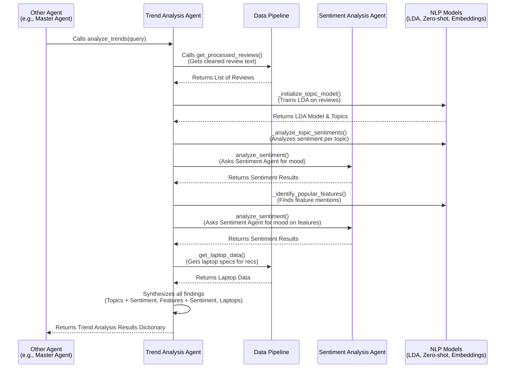

# Chapter 6: Trend Analysis Agent

Welcome back to the EggHatch AI tutorial! In our last chapter, [Sentiment Analysis Agent](05_sentiment_analysis_agent_.md), we learned how to understand the *mood* of customer reviews – whether people feel positive, negative, or neutral about a product.

Knowing how people *feel* is great, but what if we want to know *what* they are actually talking about? What specific features are causing those positive or negative feelings? What topics come up most often? This is where the **Trend Analysis Agent** steps in.

## What is the Trend Analysis Agent?

Think of the Trend Analysis Agent as your **expert market researcher**. It doesn't just count happy or sad faces; it reads through *all* the customer feedback and figures out the main topics and features that customers are discussing.

It acts like a summary engine, finding common themes in large amounts of text and telling you not just *what* those themes are, but also how people *feel* about them (by integrating the work of the [Sentiment Analysis Agent](05_sentiment_analysis_agent_.md)).

Its main goals are to:

1.  Identify **popular topics** being discussed in reviews (e.g., "battery life," "screen quality," "gaming performance").
2.  Pinpoint specific **product features** people are mentioning.
3.  Understand the **sentiment** associated with these topics and features (e.g., "people talk about battery life, and they feel mostly negative about it").

This gives us valuable insights into what matters most to customers and where products are succeeding or failing according to user feedback.

## Why Do We Need a Trend Analysis Agent?

Just like you can't read every single review for sentiment, you also can't manually go through thousands of reviews to count how many times "battery life" is mentioned or figure out if "cooling" is a common problem.

The Trend Analysis Agent automates this deep dive into the review content. This is essential for:

*   **Identifying common issues:** Quickly find out if many users complain about the same thing.
*   **Highlighting popular features:** Discover what aspects of a product users love and talk about the most.
*   **Informing recommendations:** If a specific laptop gets positive reviews *specifically* for its cooling system, and cooling is a common concern across *many* laptops, highlighting that strength in a recommendation is very helpful.
*   **Market research:** Understand the landscape of customer opinions for a category like gaming laptops.

The Trend Analysis Agent turns unstructured text data into structured insights about what's trending in customer feedback.

## The Use Case: Uncovering Gaming Laptop Review Trends

Let's go back to our running example: You ask, "What's a good gaming laptop for under $1500?".

While the [Master Agent](02_master_agent__orchestrator__.md) and other agents help find options and check specs, the Trend Analysis Agent adds a crucial layer: real-world user experience trends.

Here's how the Trend Analysis Agent might help with this query:

1.  The [Master Agent](02_master_agent__orchestrator__.md) might ask the Trend Analysis Agent to analyze reviews relevant to gaming laptops (perhaps filtered by price or models).
2.  The Trend Analysis Agent gets the necessary review data from the [Data Pipeline](04_data_pipeline_.md).
3.  It processes these reviews to find common topics. It might identify topics around "performance," "battery life," "display," and "cooling."
4.  For each topic, it asks the [Sentiment Analysis Agent](05_sentiment_analysis_agent_.md) how people feel about reviews discussing this topic. It might find "performance" sentiment is positive, "battery life" is negative, "display" is positive, and "cooling" is mixed.
5.  It also tries to identify mentions of specific features like "RTX 4060," "144Hz display," "mechanical keyboard," etc., and their associated sentiment.
6.  It packages all these findings (topics, feature mentions, and their sentiments) into a summary report.

The [Master Agent](02_master_agent__orchestrator__.md) can then use this report to provide a more nuanced answer, like recommending a laptop that performs well and highlighting that users love its screen quality, while maybe adding a note that battery life is a common downside for gaming laptops in general.

## How to Use the Trend Analysis Agent

Like other specialized agents, you interact with the Trend Analysis Agent through an object, typically obtained via a helper function to ensure you get the correct, initialized instance.

The main function to call on the `TrendAnalysisAgent` object is `analyze_trends()`.

```python
# Imagine this code is inside another agent's function
from app.agents.trend_analysis import TrendAnalysisAgent

# 1. Get the Trend Analysis Agent instance
# (In the full code, you'd get this via a getter like get_trend_analysis_agent())
# For simplicity here, let's assume it's already initialized or we init it:
trend_analyzer = TrendAnalysisAgent() 

# 2. Call the analyze_trends method
# You can optionally pass a query to focus the analysis
analysis_results = trend_analyzer.analyze_trends(query="gaming laptop under $1500")

# 3. The 'analysis_results' dictionary holds the findings!
print(analysis_results)
```

The `analyze_trends()` method takes an optional `query`. If provided, the agent might try to filter the underlying data or focus its analysis on reviews or topics most relevant to that query. It then performs its magic and returns a dictionary containing the structured insights.

What does the output look like? The `analysis_results` dictionary contains several keys:

*   `topics`: A list of dictionaries, each describing a detected topic (its keywords, an attempt at a name, and overall sentiment).
*   `popular_features`: A list of dictionaries for features identified (e.g., "display," "battery"), how often they were mentioned, and their sentiment.
*   `sentiment_overview`: An overall sentiment summary (similar to what the [Sentiment Analysis Agent](05_sentiment_analysis_agent_.md) provides directly).
*   `recommendations`: Text suggestions based on the trends (e.g., "Emphasize performance in marketing").
*   `top_laptops`: A list of laptops recommended based on criteria like ratings and potential relevance to the query.

This structured output makes it easy for the [Master Agent](02_master_agent__orchestrator__.md) to incorporate these findings into the final response.

## How the Trend Analysis Agent Works (The Flow)

Here's a simplified look at the steps when another agent asks the Trend Analysis Agent to analyze trends:



The Trend Analysis Agent is a coordinator itself in this flow. It depends heavily on the [Data Pipeline](04_data_pipeline_.md) for its input data and the [Sentiment Analysis Agent](05_sentiment_analysis_agent_.md) for sentiment scoring. It also uses various NLP (Natural Language Processing) techniques and models internally to understand the text content.

## Under the Hood: Inside `app/agents/trend_analysis.py`

Let's peek into the code file `app/agents/trend_analysis.py` to see how this market researcher agent is built.

The main component is the `TrendAnalysisAgent` class.

### Setting up the Agent

The `__init__` method prepares the agent by getting instances of other necessary agents ([Data Pipeline](04_data_pipeline_.md), [Sentiment Analysis Agent](05_sentiment_analysis_agent_.md)) and initializing the specialized NLP models it needs.

```python
# ... inside app/agents/trend_analysis.py ...
from sklearn.feature_extraction.text import CountVectorizer # For counting words
from sklearn.decomposition import LatentDirichletAllocation # The LDA model
from sentence_transformers import SentenceTransformer # For text meaning (embeddings)
from transformers import pipeline # For zero-shot classification

from app.agents.data_pipeline import get_data_pipeline # To get data
from app.agents.sentiment_analysis import get_sentiment_analyzer # To get sentiment

class TrendAnalysisAgent:
    def __init__(self):
        self.embedding_model = None # For understanding text similarity
        self.zero_shot_classifier = None # For categorizing text snippets
        self.lda_model = None # For finding topics
        self.vectorizer = None # Helper for LDA

        # Get instances of other agents
        self.data_pipeline = get_data_pipeline()
        self.sentiment_analyzer = get_sentiment_analyzer()

        # Initialize NLP models and train topic model
        self._initialize_nlp_models()
        self._initialize_topic_model() # This also calls _analyze_topic_sentiments
```

The `__init__` function gets instances of the `DataPipeline` and `SentimentAnalyzer`. It also calls internal methods (`_initialize_nlp_models` and `_initialize_topic_model`) to set up the required NLP tools and train the topic model using the data from the pipeline. This setup happens once when the agent is created.

### Finding Topics (Topic Modeling)

The `_initialize_topic_model` method is where Latent Dirichlet Allocation (LDA) is used to find recurring topics in the review text obtained from the [Data Pipeline](04_data_pipeline_.md).

```python
# ... inside the TrendAnalysisAgent class ...

    def _initialize_topic_model(self):
        """Initialize and train the LDA topic model."""
        try:
            # Get cleaned review texts from data pipeline
            all_reviews = self.data_pipeline.get_review_texts()

            # Convert text into numerical counts (words -> numbers)
            self.vectorizer = CountVectorizer(stop_words='english', max_features=1000)
            X = self.vectorizer.fit_transform(all_reviews)

            # Train the LDA model to find NUM_TOPICS (e.g., 5) topics
            self.lda_model = LatentDirichletAllocation(n_components=5) # Simplified
            self.lda_model.fit(X)

            # Get the most important words for each topic
            feature_names = self.vectorizer.get_feature_names_out()
            self.topic_words = []
            for topic_idx, topic in enumerate(self.lda_model.components_):
                 top_words_idx = topic.argsort()[:-10-1:-1] # Get top 10 words
                 top_words = [feature_names[i] for i in top_words_idx]
                 self.topic_words.append(top_words)
                 logger.info(f"Topic #{topic_idx}: {', '.join(top_words)}")

            # Analyze sentiment for these topics
            self._analyze_topic_sentiments(all_reviews, X)

        except Exception as e:
            logger.error(f"Error initializing topic model: {str(e)}")
```

This method first gets all the review texts from the `data_pipeline`. It then uses `CountVectorizer` to turn the text into a matrix of word counts (ignoring common English words). This matrix is fed to `LatentDirichletAllocation` (LDA), which finds `NUM_TOPICS` (like 5) hidden themes or topics. The agent then extracts the most frequent words for each topic (e.g., Topic 0: 'performance', 'gaming', 'gpu', 'cpu') and stores them in `self.topic_words`. Finally, it calls `_analyze_topic_sentiments`.

### Sentiment Per Topic/Feature

The `_analyze_topic_sentiments` and `_identify_popular_features` methods demonstrate how the Trend Analysis Agent uses the [Sentiment Analysis Agent](05_sentiment_analysis_agent_.md).

For topics:

```python
# ... inside the TrendAnalysisAgent class, in _analyze_topic_sentiments ...

    def _analyze_topic_sentiments(self, all_reviews, document_term_matrix):
        """Analyze sentiment for each topic."""
        try:
            # Get which topic is strongest for each review
            doc_topic_dist = self.lda_model.transform(document_term_matrix)

            for topic_idx in range(NUM_TOPICS):
                # Find reviews where this topic is the main theme
                topic_docs_indices = [i for i in range(len(all_reviews))
                                    if np.argmax(doc_topic_dist[i]) == topic_idx]

                if not topic_docs_indices: continue

                # Get a sample of these reviews
                sampled_docs = np.random.choice([all_reviews[i] for i in topic_docs_indices], size=min(10, len(topic_docs_indices)), replace=False)

                # Ask the Sentiment Analysis Agent for sentiment on these reviews
                sentiment_results = self.sentiment_analyzer.analyze_sentiment(list(sampled_docs))

                # Count positive/negative/neutral sentiments in the results
                positive_count = sum(1 for s in sentiment_results if s['label'] == 'positive')
                negative_count = sum(1 for s in sentiment_results if s['label'] == 'negative')
                # ... calculate neutral_count ...

                # Determine overall sentiment for the topic (e.g., 'positive', 'negative', 'mixed')
                # ... (logic based on counts) ...

                self.topic_sentiments[topic_idx] = {
                    'distribution': {'positive': ..., 'negative': ..., 'neutral': ...},
                    'overall': overall_sentiment_label
                }
        except Exception as e:
             logger.error(f"Error analyzing topic sentiments: {str(e)}")
```

This function identifies which reviews primarily discuss each topic found by LDA. It then takes a small sample of these reviews and passes them to `self.sentiment_analyzer.analyze_sentiment()`. The results from the sentiment agent are used to determine the overall sentiment (positive, negative, or mixed) for that specific topic.

For features:

```python
# ... inside the TrendAnalysisAgent class, in _identify_popular_features ...

    def _identify_popular_features(self):
        """Identify popular features using NLP techniques."""
        try:
            # Get review texts
            all_reviews = self.data_pipeline.get_review_texts()

            # Use a zero-shot classifier (if available) or keyword matching
            if self.zero_shot_classifier:
                 # Sample reviews and use zero-shot to categorize them by feature categories
                 # ... calls self.zero_shot_classifier(review, candidate_labels=self.feature_categories) ...

                 for review in sampled_reviews:
                     # Get zero-shot results for features in this review
                     # ... (logic to identify features like 'display', 'battery') ...

                     # For each identified feature mention in this review:
                     sentiment_result = self.sentiment_analyzer.analyze_sentiment([review])[0]
                     sentiment = sentiment_result['label'] # Get sentiment from Sentiment Agent

                     # Count the mention and its sentiment for that feature category
                     # feature_data[category]['mentions'] += 1
                     # feature_data[category]['sentiment'][sentiment] += 1

                 # ... aggregate and sort results ...

            else: # Fallback to keyword matching
                 # ... loops through reviews and checks for keywords like 'screen', 'battery' ...
                 # ... calls self.sentiment_analyzer.analyze_sentiment([review_text])[0] for sentiment ...
                 # ... counts mentions and sentiment per feature category ...

            # Format results and return top features
            return results[:5]

        except Exception as e:
            logger.error(f"Error identifying popular features: {str(e)}")
            return []
```

This method uses either a powerful "zero-shot" classification model (which can categorize text without needing specific training data for each category) or a simpler keyword-matching approach to find mentions of specific product features like "display," "battery," "cooling," etc., within the reviews. When it finds a mention of a feature, it analyzes the sentiment of the *review containing that mention* by calling `self.sentiment_analyzer.analyze_sentiment()` and records the sentiment associated with that feature. Finally, it counts which features were mentioned most often and summarizes the sentiment distribution for each popular feature.

### Generating Topic Names and Recommendations

The agent also tries to give meaningful names to the abstract topics found by LDA (`_generate_topic_name`) and provides basic recommendations based on the overall trends (`_generate_recommendations`). These methods also often leverage the results from the sentiment analysis.

```python
# ... inside the TrendAnalysisAgent class, in _generate_topic_name ...

    def _generate_topic_name(self, topic_words):
        """Generate a descriptive name for a topic."""
        # Tries using an embedding model (SentenceTransformer) to find semantic similarity
        # between topic keywords and predefined candidate names (like "Gaming Performance").
        # Or uses the zero-shot classifier to categorize the topic words.

        # If successful and confident:
        # return "Category Name Discussion"

        # Fallback if NLP models fail or confidence is low:
        return f"Topic: {', '.join(topic_words[:3])}".title()

# ... inside the TrendAnalysisAgent class, in _generate_recommendations ...

    def _generate_recommendations(self, query=None):
        """Generate recommendations based on trend analysis."""
        recommendations = []

        # Look at popular features and their sentiment
        # If a feature like 'performance' is popular and positive:
        # recommendations.append("Emphasize performance in marketing...")

        # Look at topic sentiments
        # If 'battery' topic has negative sentiment:
        # recommendations.append("Address battery life concerns...")

        # Look at overall sentiment overview (from self.sentiment_analyzer)
        # If average rating is high:
        # recommendations.append("Overall sentiment is very positive...")

        # Filter recommendations by query if applicable

        return recommendations[:5] # Return top recommendations
```

These snippets show how the agent attempts to make the abstract topic findings more understandable and provides actionable text recommendations by looking at which topics/features are popular and whether their sentiment is positive or negative.

### The Main Entry Point

The `analyze_trends` method orchestrates the entire process, calling the relevant internal methods and packaging the results.

```python
# ... inside the TrendAnalysisAgent class ...

    def analyze_trends(self, query=None):
        """
        Analyze trends and sentiment in reviews.
        """
        try:
            # Get filtered reviews and laptop data from the Data Pipeline
            # ... calls self.data_pipeline.filter_reviews_by_query(query) ...
            # ... calls self.data_pipeline.get_laptop_data() ...

            results = {
                'topics': [], # Add topic info by looping through self.topic_words and self.topic_sentiments
                'popular_features': self._identify_popular_features(), # Call feature identification
                'sentiment_overview': self.sentiment_analyzer.get_sentiment_overview(reviews), # Get overall sentiment
                'recommendations': self._generate_recommendations(query), # Generate text recommendations
                'top_laptops': [], # Select and format top laptops based on data/query
            }

            return results

        except Exception as e:
            logger.error(f"Error analyzing trends: {str(e)}")
            return {'error': str(e)}
```

This function serves as the public interface for the Trend Analysis Agent. It pulls together all the analysis steps: getting data, running topic modeling (which happens during initialization), identifying popular features, getting the overall sentiment overview, generating text recommendations, and selecting potential top laptops. All these results are combined into a single dictionary that's returned to the caller.

## Conclusion

In this chapter, we've explored the Trend Analysis Agent, EggHatch AI's market researcher. We learned how it goes beyond just sentiment to identify the actual topics and features customers are discussing in reviews. It uses techniques like topic modeling (LDA) and feature identification (zero-shot classification or keywords), working closely with the [Data Pipeline](04_data_pipeline_.md) for data and the [Sentiment Analysis Agent](05_sentiment_analysis_agent_.md) to understand the mood around specific trends. The output provides valuable, structured insights into customer feedback, helping other agents (especially the [Master Agent](02_master_agent__orchestrator__.md)) build more informed and helpful responses.

These specialized agents perform specific tasks. But how does the [Master Agent](02_master_agent__orchestrator__.md) keep track of what needs to be done, what results have been gathered, and the overall progress? That's managed by the **Agent State**, which we'll dive into in the next chapter!

[Next Chapter: Agent State](07_agent_state_.md)

---

Generated by [AI Codebase Knowledge Builder](https://github.com/The-Pocket/Tutorial-Codebase-Knowledge)
