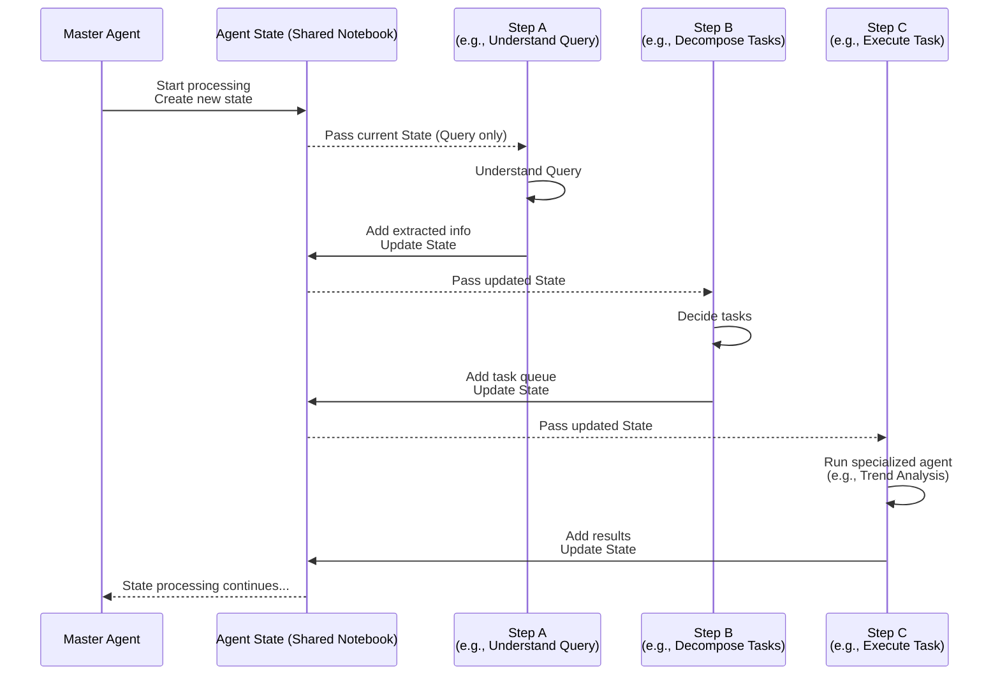

# Chapter 7: Agent State

Welcome back to the EggHatch AI tutorial! In the last few chapters, we've explored some key parts of our system:
*   The [Master Agent (Orchestrator)](02_master_agent__orchestrator__.md) acts as the brain, deciding the steps needed to answer your query.
*   The [LLM Client](03_llm_client_.md) lets the Master Agent talk to the AI model.
*   The [Data Pipeline](04_data_pipeline_.md) prepares the data for analysis.
*   Specialized agents like the [Sentiment Analysis Agent](05_sentiment_analysis_agent_.md) and [Trend Analysis Agent](06_trend_analysis_agent_.md) perform specific analysis tasks using that data.

As the [Master Agent (Orchestrator)](02_master_agent__orchestrator__.md) guides your request through these different components and steps, a lot of information is generated: your original question, extracted details (like budget), results from the analysis agents (like trending topics), and the final answer being put together.

Where does all this information go? How do the different steps know what the previous steps found? This is where the **Agent State** comes in.

## What is the Agent State?

Imagine the Agent State is a **shared notebook** or a **digital whiteboard** that travels with your query as it's processed by the [Master Agent (Orchestrator)](02_master_agent__orchestrator__.md).

When your query starts its journey:
1.  The notebook is created, and your original question is written down.
2.  The "Understand Query" step reads the question from the notebook, figures out your budget and use case, and writes those findings back into the notebook.
3.  The "Decompose Tasks" step reads the budget/use case from the notebook, decides which specialist agents are needed (like Trend Analysis), and writes a list of tasks into the notebook.
4.  The "Execute Task" step reads the first task from the notebook, calls the appropriate agent ([Trend Analysis Agent](06_trend_analysis_agent_.md) in our example), gets the results, and writes those results (trend insights, sentiment overview) into the notebook.
5.  This continues until all tasks are done.
6.  Finally, the "Synthesize Response" step reads *everything* from the notebook (original query, requirements, all the results) and uses it to write the final answer into the notebook.

The Agent State is the **single source of truth** for everything related to your current query's processing. Every step involved in handling your request uses the Agent State to:

*   **Read:** Get information from previous steps.
*   **Write:** Add new information or update existing details based on its task.

## Why Do We Need Agent State?

Without a shared notebook like the Agent State, each step in the [Master Agent's (Orchestrator's)](02_master_agent__orchestrator__.md) workflow would be isolated. How would the "Synthesize Response" step know the trend insights if the "Execute Task" step didn't put them somewhere accessible?

The Agent State provides:

*   **Context:** Keeps track of the user's original request and conversation history.
*   **Persistence:** Holds intermediate results from various processing steps.
*   **Communication:** Acts as the bridge for different parts of the system (nodes in the Master Agent's graph, specialized agents) to share information.

It ensures that all the valuable information gathered throughout the process is available when and where it's needed, especially for building the final, comprehensive response.

## The Use Case: Building a Recommendation

Let's revisit our example: "What's a good gaming laptop for under $1500?".

Here's how the Agent State would evolve:

*   **Initial State:** `{"user_query": "What's a good gaming laptop for under $1500?", "conversation_history": [...]}`
*   **After `understand_query`:** Adds extracted details. `{"user_query": ..., "query_type": "laptop_recommendation", "budget": "$1500", "use_case": "gaming", ...}`
*   **After `decompose_tasks`:** Adds tasks. `{"user_query": ..., "budget": ..., "task_queue": ["trend_and_sentiment_analysis"], ...}`
*   **After `execute_current_task` (running Trend/Sentiment):** Adds analysis results. `{"user_query": ..., "budget": ..., "task_queue": [], "trend_insights": {...}, "sentiment_analysis": {...}, ...}`
*   **After `synthesize_response`:** Adds the final answer. `{"user_query": ..., "budget": ..., "task_queue": [], "trend_insights": {...}, "sentiment_analysis": {...}, "final_response": "Based on...", ...}`

The final `final_response` is only possible because the `synthesize_response` step could access the `user_query`, `budget`, `trend_insights`, and `sentiment_analysis` from the Agent State.

## How the Agent State Works (High Level Flow)

The [Master Agent (Orchestrator)](02_master_agent__orchestrator__.md), built with LangGraph, explicitly manages the flow of the Agent State. When the Master Agent moves from one step (node) to the next, it passes the current Agent State along. The next step receives this state, does its work (potentially using other agents), and then indicates how the state should be updated.



In this flow, the Agent State is central. Each step in the Master Agent's graph receives the current state, performs its specific action, and then returns the modifications it made to the state. LangGraph automatically merges these modifications back into the main state object before passing it to the next node.

## Under the Hood: Inside `app/master_agent.py`

The definition and management of the Agent State are handled within the [Master Agent (Orchestrator)](02_master_agent__orchestrator__.md) code, primarily in `app/master_agent.py`.

### Defining the State Structure

The Agent State is defined as a Python class using `pydantic.BaseModel`. This gives it a clear, structured format, like defining the columns in our shared notebook.

```python
# ... from app/master_agent.py ...
from pydantic import BaseModel, Field
from typing import Dict, List, Optional, Union, Any

# Define state schema
class AgentState(BaseModel):
    """State for the EggHatch AI agent."""
    
    # User interaction
    user_query: str = Field(default="")
    conversation_history: List[Dict[str, str]] = Field(default_factory=list)
    
    # Extracted information
    query_type: str = Field(default="")
    budget: Optional[str] = Field(default=None)
    # ... other fields like use_case, requirements ...
    
    # Task management
    # ... fields like current_task, task_queue, waiting_for ... 
    
    # Tool results - POC focuses only on trend and sentiment analysis
    trend_insights: Optional[Dict[str, Any]] = Field(default=None)
    sentiment_analysis: Optional[Dict[str, Any]] = Field(default=None)
    
    # Response
    final_response: str = Field(default="")

# ... rest of the file ...
```

This `AgentState` class lists all the pieces of information that the Master Agent workflow needs to track: the user's question (`user_query`), conversation history, extracted details (`query_type`, `budget`), results from analysis agents (`trend_insights`, `sentiment_analysis`), and the final answer being built (`final_response`). Using `pydantic` helps keep this structure organized.

### Initializing the State

When a new query comes in (or a new turn in a conversation), an initial `AgentState` object (or a dictionary representation of it) is created. This happens in the `process_query` function.

```python
# ... from app/master_agent.py, inside process_query function ...

    # Check if we have a thread_id and if it exists in our thread_states
    if thread_id and thread_id in thread_states:
        # Get the previous state for this thread
        previous_state = thread_states[thread_id]
        
        # Initialize state with previous context but new query
        initial_input_dict = {
            "user_query": query,
            "conversation_history": previous_state.get("conversation_history", []),
            "query_type": previous_state.get("query_type", ""),
            "budget": previous_state.get("budget", None),
            # ... copy other relevant fields from previous_state ...
            "final_response": "" # Always reset final response for a new turn
        }
        print(f"Using existing thread {thread_id} with context...")
    else:
        # Initialize state as a dictionary for LangGraph's invoke method
        initial_input_dict = {
            "user_query": query,
            "conversation_history": [],
            "query_type": "",
            "budget": None,
            # ... initialize all fields with default or None ...
            "final_response": ""
        }
        
        # ... generate new thread_id if needed ...
    
    # Run the agent (LangGraph takes this dictionary as input)
    final_state_dict = agent.invoke(initial_input_dict)

# ... rest of process_query ...
```

The `process_query` function checks if this is part of an ongoing conversation (`thread_id`). If yes, it loads the state from the previous turn and uses it as the starting point, just updating the `user_query`. If it's a new conversation, it starts with a fresh, empty state. This initial state (represented as a dictionary) is then passed to the `agent.invoke()` method, which starts the LangGraph workflow.

### Updating the State in Nodes

Each function that acts as a node in the Master Agent's graph receives the current state as an argument. These functions perform their logic and then **return a dictionary containing only the fields they want to change or add** to the state. LangGraph automatically merges these changes into the central state.

Here's a simplified example from the `understand_query` node:

```python
# ... from app/master_agent.py, inside understand_query function ...

    # ... Logic to call LLM and extract info ...
    
    # Assume extracted_info = {"query_type": "laptop_recommendation", "budget": "$1500"}

    # Create a dictionary with ONLY the fields to update
    updated_fields = {}
    
    # Add extracted information to the dictionary
    if extracted_info:
        updated_fields["query_type"] = extracted_info.get("query_type", state.query_type)
        updated_fields["budget"] = extracted_info.get("budget", state.budget)
        # ... add other extracted fields ...
    
    # Return the dictionary of changes
    return updated_fields

# ... rest of understand_query ...
```

The `understand_query` function receives the `state` (which is an `AgentState` object). It uses the `llm_client` to analyze the query and then creates the `updated_fields` dictionary. It puts the values it wants to change (like `query_type` and `budget`) into this dictionary. When the function finishes, LangGraph takes this dictionary and updates the main `AgentState` object.

Another example in `execute_current_task`:

```python
# ... from app/master_agent.py, inside execute_current_task function ...

    # ... Logic to get current_task from state.task_queue ...
    # ... Logic to run TrendAnalysisAgent if current_task is "trend_and_sentiment_analysis" ...
    
    # Assume trend_results = {"topics": [...], "sentiment_overview": {...}, ...}

    # Initialize dictionary for updated fields
    updated_fields = {}
    
    # Add results from the executed task to the dictionary
    if current_task == "trend_and_sentiment_analysis":
        updated_fields["trend_insights"] = trend_results
        
        # Store sentiment analysis results separately if available
        if trend_results and trend_results.get('sentiment_overview'):
             updated_fields["sentiment_analysis"] = trend_results.get('sentiment_overview')
    
    # Also update the task queue by removing the completed task
    # (Simplified logic)
    updated_fields["task_queue"] = state.task_queue[1:]
    
    # Return the dictionary of changes
    return updated_fields

# ... rest of execute_current_task ...
```

This function executes a task (like calling the `TrendAnalysisAgent`). It receives the current `state`, performs the action, gets results (`trend_results`), and then constructs `updated_fields` to add these results to the state (e.g., `updated_fields["trend_insights"] = trend_results`). It also updates the `task_queue` to show which tasks are left. LangGraph merges these updates into the state.

Finally, in `synthesize_response`, the node reads from the state and writes the final result:

```python
# ... from app/master_agent.py, inside synthesize_response function ...

    # Access data from the state (or its dictionary representation)
    trend_insights = state.get("trend_insights", {}) # Accessing fields from state
    sentiment_analysis = state.get("sentiment_analysis", {})
    user_query = state.get("user_query", "")
    
    # ... Logic to combine insights and call LLM to synthesize response ...
    
    # Assume final_response_text is the generated response

    # Initialize dictionary for updated fields
    updated_fields = {}
    
    # Add the generated final response to the dictionary
    updated_fields["final_response"] = final_response_text
    
    # Update conversation history in the state
    updated_fields["conversation_history"] = state.get("conversation_history", []) + [
        {"role": "user", "content": user_query},
        {"role": "assistant", "content": final_response_text}
    ]
    
    # Return the dictionary of changes
    return updated_fields

# ... rest of synthesize_response ...
```

The `synthesize_response` function reads the `trend_insights` and `sentiment_analysis` (among other fields) from the incoming `state`. It uses these to generate the `final_response_text` using the `llm_client`. It then creates `updated_fields` containing this `final_response` and updates the `conversation_history` to include this turn. This dictionary is returned, and LangGraph updates the state.

### Storing the Final State

After the LangGraph workflow finishes (reaches the `END` node), the `process_query` function gets the complete, final state. This final state is then stored for potential use in the next turn of the conversation, allowing the AI to remember context.

```python
# ... from app/master_agent.py, inside process_query function ...

    # Run the agent with the initial state
    final_state_dict = agent.invoke(initial_input_dict)
    
    # Store the final state for this thread for multi-turn conversations
    thread_states[thread_id] = final_state_dict # Store the final state dictionary

    # ... Extract response and other info from final_state_dict to return to UI ...
    response_dict = {
        "response": final_state_dict.get("final_response", "..."),
        "trend_insights": final_state_dict.get("trend_insights", {}),
        # ... include other state info needed by the UI ...
        "thread_id": thread_id # Return the thread ID so the UI can send it back next time
    }
    
    return response_dict
```

The `thread_states` dictionary in `master_agent.py` acts as a simple database to store the `final_state_dict` for each ongoing conversation (`thread_id`). When the same `thread_id` is received in a subsequent `process_query` call, the previous state is loaded, providing memory to the agent.

In summary, the Agent State, defined using Pydantic, serves as the central data container. The LangGraph workflow in the [Master Agent (Orchestrator)](02_master_agent__orchestrator__.md) passes this state between nodes, and each node reads from and writes to the state by returning a dictionary of changes. This shared notebook approach is fundamental to how the Master Agent coordinates information and builds the final response.

## Conclusion

In this chapter, we've learned about the Agent State, the crucial data structure that acts as a shared notebook or whiteboard for the [Master Agent (Orchestrator)](02_master_agent__orchestrator__.md). It holds all the information needed as a user query is processed, from the initial request and extracted requirements to the results from specialized agents and the final response. We saw how it's defined using Pydantic and how different steps (nodes) in the Master Agent's workflow read from and write to this state, enabling seamless communication and the eventual synthesis of a comprehensive answer.

Now that we understand how the agent keeps track of everything, what about the actual instructions given to the AI models? How do we tell the [LLM Client](03_llm_client_.md) what to ask the AI to extract information or synthesize a response? That's handled by **Prompts**, which we'll explore in the next chapter!

[Next Chapter: Prompts](08_prompts_.md)

---

Generated by [AI Codebase Knowledge Builder](https://github.com/The-Pocket/Tutorial-Codebase-Knowledge)
