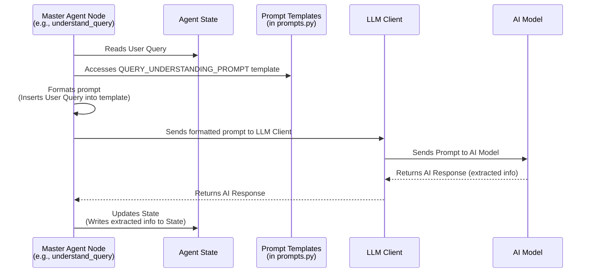

# Chapter 8: Prompts

Welcome back to the EggHatch AI tutorial! In the last chapter, [Agent State]({{ site.baseurl }}/07_agent_state_.html), we saw how the [Master Agent (Orchestrator)]({{ site.baseurl }}/02_master_agent__orchestrator__.html) uses a shared notebook, the Agent State, to keep track of all the information gathered as it processes your request. This state includes your original question, extracted details like your budget, and the results from specialized agents like the [Trend Analysis Agent]({{ site.baseurl }}/06_trend_analysis_agent_.html).

But how does the system actually *tell* the AI model what to do with this information? How does it instruct the AI to understand your question, extract details, or write a helpful response using the data collected? This is where **Prompts** come in.

## What are Prompts?

Think of prompts as the **instructions** or **scripts** that we give to the AI model through the [LLM Client]({{ site.baseurl }}/03_llm_client_.html). They are formatted pieces of text designed to guide the AI to perform a very specific task.

In the context of EggHatch AI, prompts are what tell the underlying Large Language Model (LLM) things like:

*   "Read this user's question and tell me if they want a laptop recommendation or a PC build."
*   "Here are the results from the analysis. Write a helpful summary for the user based *only* on this data."
*   "Act as a tech assistant and keep your answers focused on PC parts."

They are the blueprints that dictate the AI's behavior and the nature of its output at various points in our system's workflow.

## Why Do We Need Prompts?

AI models like the one we use (Gemma via Ollama) are incredibly powerful, but they don't automatically know what we want them to do at any given moment. They need clear direction.

Without prompts, our [Master Agent (Orchestrator)]({{ site.baseurl }}/02_master_agent__orchestrator__.html) couldn't leverage the AI's intelligence for specific steps like:

*   **Understanding:** How does the system know your budget is "$1500" from the text "under $1500"? It prompts the AI to extract it.
*   **Analysis Interpretation:** The analysis agents ([Sentiment Analysis Agent]({{ site.baseurl }}/05_sentiment_analysis_agent_.html), [Trend Analysis Agent]({{ site.baseurl }}/06_trend_analysis_agent_.html)) provide structured data (like lists of topics and their sentiment), but the AI needs a prompt to understand this data and use it to write a human-readable summary.
*   **Response Generation:** How does the system turn all the collected insights (from the [Agent State]({{ site.baseurl }}/07_agent_state_.html)) into a coherent, friendly answer? It uses a prompt to instruct the AI on what to include and how to format it.

Prompts are the essential interface between our system's logic (deciding *what* needs to be done) and the AI model's capability (actually doing the language processing task).

## What Changed In The Latest Repo

The response synthesis prompt now has to cooperate with the new structured comparison layer. If comparison data is present, the final answer is expected to explain:

- which laptop wins
- why it wins
- what the main tradeoff is

This is a subtle but important shift. The prompt is no longer only summarizing trends; it is now coordinating with a deterministic comparison object.

## The Use Case: Getting a Recommendation (Again!)

Let's use our familiar example: You ask, "What's a good gaming laptop for under $1500?".

As the [Master Agent (Orchestrator)]({{ site.baseurl }}/02_master_agent__orchestrator__.html) processes this query, it needs the AI to perform several tasks, each requiring a specific prompt:

1.  **Understand the Query:** The Master Agent needs to figure out you want a *laptop*, for *gaming*, with a *budget* of `$1500`. It sends a prompt like, "Here is the user's query. Extract the query type, budget, and use case as JSON."
2.  **Synthesize the Response:** After the analysis agents ([Trend Analysis Agent]({{ site.baseurl }}/06_trend_analysis_agent_.html), [Sentiment Analysis Agent]({{ site.baseurl }}/05_sentiment_analysis_agent_.html)) have provided their results (stored in the [Agent State]({{ site.baseurl }}/07_agent_state_.html)), the Master Agent needs the AI to write the final answer. It sends a prompt like, "Here is the user's original query and the analysis results. Write a brief recommendation using *only* the provided data."

Different tasks require different prompts. The prompt gives the AI context, instructions, and often the data it needs to work with for that specific step.

## How Prompts Work (High-Level Flow)

Prompts are created and sent by the code that needs the AI's help (like a node in the [Master Agent's (Orchestrator's)]({{ site.baseurl }}/02_master_agent__orchestrator__.html) graph). This code fetches necessary information from the [Agent State]({{ site.baseurl }}/07_agent_state_.html) and combines it with a predefined prompt template to create the final text instruction for the AI. This instruction is then sent via the [LLM Client]({{ site.baseurl }}/03_llm_client_.html).

Here's a simple flow focusing on how a prompt is used in one step:



This diagram shows that a Master Agent node doesn't just magic an answer out of nowhere. It uses information from the [Agent State]({{ site.baseurl }}/07_agent_state_.html), accesses a predefined prompt template, customizes the template with the specific data for this query, sends that customized prompt via the [LLM Client]({{ site.baseurl }}/03_llm_client_.html), and processes the AI's response.

## Under the Hood: Inside `app/prompts.py`

The actual text of the prompts used in EggHatch AI is stored in the `app/prompts.py` file. This keeps the prompts organized and separate from the logic that uses them.

Let's look at some simplified examples from this file.

### System Prompt

This is a general instruction given to the AI model at the start of a conversation or task to define its overall role and behavior.

```python
# --- from app/prompts.py ---

MASTER_AGENT_SYSTEM_PROMPT = """
You are EggHatch AI, a PC building and tech gear shopping assistant.
Your task is to help users with PC components, gaming laptops, and tech gear recommendations.
Focus on understanding their needs, budget, and preferences to provide helpful suggestions.
"""
```

This `MASTER_AGENT_SYSTEM_PROMPT` tells the AI, "Hey, remember you are a helpful tech assistant focusing on PC stuff." It sets the stage for all interactions. This prompt is often sent along *with* other specific task prompts via the [LLM Client]({{ site.baseurl }}/03_llm_client_.html).

### Query Understanding Prompt

This prompt is used by the `understand_query` node in the [Master Agent (Orchestrator)]({{ site.baseurl }}/02_master_agent__orchestrator__.html) to extract structured information from the user's free-text question.

```python
# --- from app/prompts.py ---

QUERY_UNDERSTANDING_PROMPT = """
Analyze this query about PC components or tech gear:

USER QUERY: {user_query}

Extract and return a JSON object with:
- query_type (e.g., gaming_pc_build, laptop_recommendation)
- budget (or null)
- use_case (e.g., gaming, content_creation)
- requirements: Specific requirements or preferences

Format: ```json
{{
  "query_type": "example",
  "budget": "$1000",
  "use_case": "example",
  "requirements": {{}}
}}
```
"""
```

Notice the `{user_query}` part. This is a placeholder! Before sending this prompt to the [LLM Client]({{ site.baseurl }}/03_llm_client_.html), the code using this prompt (the `understand_query` function) replaces `{user_query}` with the actual question from the user, fetched from the [Agent State]({{ site.baseurl }}/07_agent_state_.html). This makes the prompt reusable for any user query. The prompt also gives the AI specific instructions on what to extract (`query_type`, `budget`, etc.) and even provides an example of the expected JSON `Format`.

Here's how the `understand_query` function in `app/master_agent.py` uses this prompt (simplified):

```python
# --- from app/master_agent.py (simplified) ---
# ... imports and setup ...
from app.prompts import QUERY_UNDERSTANDING_PROMPT
# ... llm_client initialization ...

def understand_query(state):
    # ... checks for scope/vague ...

    # Format the prompt using the user_query from the state
    formatted_prompt = QUERY_UNDERSTANDING_PROMPT.format(user_query=state.user_query)

    # Send the formatted prompt to the LLM client
    response_generator = llm_client.generate(
        prompt=formatted_prompt,
        system_prompt=MASTER_AGENT_SYSTEM_PROMPT # Often include the system prompt too
    )

    # ... collect response and update state ...
    return updated_fields
```

The code takes the template, fills in the blank (`.format(user_query=...)`), and then sends the complete, specific instruction to the `llm_client`.

### Response Synthesis Prompt

This prompt is used by the `synthesize_response` node in the [Master Agent (Orchestrator)]({{ site.baseurl }}/02_master_agent__orchestrator__.html) to generate the final human-readable answer presented in the [User Interface (Dashboard)]({{ site.baseurl }}/01_user_interface__dashboard__.html).

```python
# --- from app/prompts.py ---

RESPONSE_SYNTHESIS_PROMPT = """
Create a concise, helpful response for this query: {user_query}

Use ONLY the following real data from our analysis of 250+ gaming laptops and reviews:
- Trends and Sentiment Analysis: {trend_insights}

Your response MUST:
1. Be brief and to the point (max 150 words)
2. Provide 2-3 SPECIFIC laptop recommendations from our dataset with ACTUAL prices
3. Reference REAL features and sentiment scores from the data provided
4. NOT include ANY meta-commentary about the analysis process
5. NOT mention hypothetical data or placeholder information

The user wants factual recommendations based on our actual laptop database, not generic advice.
"""
```

This prompt is more complex. It takes two main pieces of information from the [Agent State]({{ site.baseurl }}/07_agent_state_.html): the original `{user_query}` and the `{trend_insights}` gathered by the [Trend Analysis Agent]({{ site.baseurl }}/06_trend_analysis_agent_.html) (which includes sentiment information from the [Sentiment Analysis Agent]({{ site.baseurl }}/05_sentiment_analysis_agent_.html)). It uses these placeholders to inject the specific context and analysis results into the prompt.

Crucially, this prompt also includes **constraints** and **instructions** for the AI model, telling it exactly how to format the response ("Be brief," "Provide 2-3 SPECIFIC laptop recommendations," "Use ONLY the following real data," "MUST NOT include ANY meta-commentary"). These instructions are critical for ensuring the AI's output is useful and fits the purpose of EggHatch AI.

Here's how the `synthesize_response` function in `app/master_agent.py` uses this prompt (simplified):

```python
# --- from app/master_agent.py (simplified) ---
# ... imports and setup ...
from app.prompts import RESPONSE_SYNTHESIS_PROMPT
# ... llm_client initialization ...

def synthesize_response(state):
    # Access required data from the state
    user_query = state.get("user_query", "")
    trend_insights = state.get("trend_insights", {}) # Get analysis results

    # Format the prompt with user query and insights
    formatted_prompt = RESPONSE_SYNTHESIS_PROMPT.format(
        user_query=user_query,
        trend_insights=trend_insights # Pass the analysis results here
    )

    # Send the formatted prompt to the LLM client
    response_generator = llm_client.generate(
        prompt=formatted_prompt,
        system_prompt=MASTER_AGENT_SYSTEM_PROMPT # Often include the system prompt too
    )

    # ... collect response, format final response, and update state ...
    return updated_fields
```

The `synthesize_response` function pulls the necessary information from the `state` dictionary (remember, the state travels with the query). It then uses Python's `.format()` method to insert this data into the prompt template before sending it to the `llm_client`. The AI receives the full instruction, including the user's question *and* the analysis data, and is told to write the final answer according to the specified rules.

### Other Prompts

The `app/prompts.py` file might contain other prompts as the system evolves. For example, a prompt to help the AI decide if more information is needed from the user (`check_information_completeness` node) or prompts specifically for fine-tuning the behavior of specialized agents. The `TREND_ANALYSIS_PROMPT` example in `app/prompts.py` shows a prompt that a future, more advanced Trend Analysis Agent might use directly to get the LLM to summarize raw trend data, although in the current POC, the Trend Analysis Agent handles summarization internally and the Master Agent uses a different synthesis prompt.

The key takeaway is that `app/prompts.py` is the central place where all these instructions for the AI are defined as text templates, making them easy to find, read, and modify separately from the system's core logic.

## Conclusion

In this chapter, we've learned that Prompts are the specific text instructions sent to the AI model via the [LLM Client]({{ site.baseurl }}/03_llm_client_.html). They are like scripts that tell the AI exactly what task to perform at different steps in the [Master Agent's (Orchestrator's)]({{ site.baseurl }}/02_master_agent__orchestrator__.html) workflow – whether it's understanding a user query, interpreting analysis results from agents like the [Trend Analysis Agent]({{ site.baseurl }}/06_trend_analysis_agent_.html) and [Sentiment Analysis Agent]({{ site.baseurl }}/05_sentiment_analysis_agent_.html), or generating the final response displayed in the [User Interface (Dashboard)]({{ site.baseurl }}/01_user_interface__dashboard__.html). Prompts use information stored in the [Agent State]({{ site.baseurl }}/07_agent_state_.html) and provide crucial instructions and constraints to guide the AI's behavior. The prompt definitions are managed centrally in `app/prompts.py`.

We've now covered many of the core components of EggHatch AI! We've seen the UI, the orchestrator, how it talks to the AI and gets data, and how it keeps track of things. What comes next? The provided structure doesn't specify chapters beyond this one, so we'll wrap up here.

Thank you for following this tutorial and learning about the different parts of the EggHatch AI system!

---

Generated by [AI Codebase Knowledge Builder](https://github.com/The-Pocket/Tutorial-Codebase-Knowledge)
