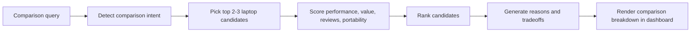

# Chapter 9: Explainable Comparison

EggHatch-AI now includes a structured comparison layer for gaming laptop questions. This is one of the most meaningful recent changes in the repository because it moves the system from "giving recommendations" to **explaining why one option wins over another**.

Before this feature, the project could summarize trends, sentiment, and candidate laptops, but the final answer still depended heavily on free-form LLM wording. That made comparisons harder to trust.

The new comparison flow changes that by producing a deterministic comparison object before the final response is written.

## Why This Matters

Laptop shopping is full of tradeoffs:

- price vs performance
- portability vs thermal headroom
- review quality vs raw specs
- value vs premium features

If the system only answers with prose, the user gets a recommendation but not necessarily a decision framework. The new comparison module gives EggHatch-AI a more explainable shape.

## What The Comparison Layer Produces

The comparison helper generates a structured object that includes:

- the recommended laptop
- a short summary of why it won
- top reasons
- main tradeoffs
- ranked candidate laptops
- dimension winners

Those dimensions are intentionally simple and local to the current POC:

1. Performance
2. Value
3. Reviews
4. Portability

## The Flow



## Where It Lives In The Code

The deterministic logic is isolated in:

```text
app/agents/comparison.py
```

That file is intentionally not a giant recommendation engine. It is a focused helper that keeps the explanation logic:

- small
- inspectable
- testable
- independent from the LLM wording layer

## Why This Is A Good Prototype Design

EggHatch-AI is still a local prototype. That means it should not pretend to have production-grade ranking logic. The comparison helper reflects that philosophy:

- it uses fixture data
- it uses simple weighting instead of hidden models
- it degrades cleanly
- it makes tradeoffs visible

This makes it a better teaching artifact and a better open-source demo.
