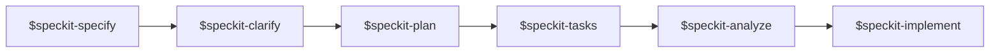

# Chapter 10: Spec-Driven Workflow

The latest EggHatch-AI repo does not only add features. It also adds a **spec-driven development scaffold** so future changes can be planned and reviewed more deliberately.

This shows up in the repository as:

- `.agents/skills/`
- `.specify/`
- `AGENTS.md`
- a project-specific constitution

## Why Add This To A Small Repo?

Even a compact AI prototype can drift quickly:

- a demo starts pretending to be production
- scope expands without clear boundaries
- agent behavior gets more complex without a shared rationale
- UI improvements can hide weak data assumptions

The spec-driven scaffold helps slow that drift down.

## The Core Idea

Instead of jumping straight into code, the project now has a default path for feature work:



This is especially useful for a repo like EggHatch-AI because the biggest risk is not syntax or tooling failure. The biggest risk is **scope confusion**.

## The Constitution

The most important project-specific file in the new scaffold is:

```text
.specify/memory/constitution.md
```

That file establishes rules such as:

- prototype honesty over product theater
- explainable agent workflows over black-box answers
- local-first defaults with graceful degradation
- explicit source integrity and freshness limits
- keep the system small, testable, and worth reading

Those principles fit EggHatch-AI well because they keep the project honest about what it is.

## What The Skills Do

Each folder in `.agents/skills/` contains one `SKILL.md` file.

The most important ones are:

- `speckit-specify` — define the feature
- `speckit-plan` — decide how to implement it
- `speckit-tasks` — break work into steps
- `speckit-implement` — execute
- `speckit-analyze` — check for drift or inconsistency

## A Real Example In This Repo

The explainable comparison feature is a good example of why this workflow helps.

The feature can be framed in a structured way:

1. Define the user-facing need: compare 2-3 laptops clearly
2. Plan the implementation boundary: comparison helper, trend analysis, UI rendering, tests
3. Break it into tasks
4. Implement without losing the repository's prototype constraints

That is exactly the kind of discipline a growing open-source AI repo benefits from.
