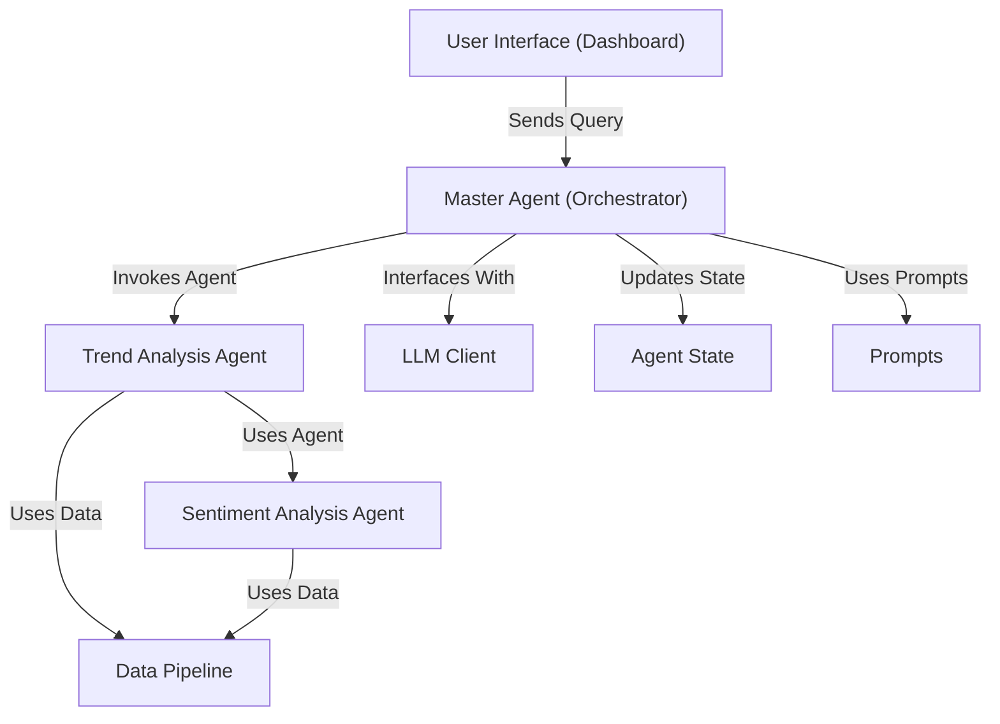

# Tutorial: EggHatch-AI

EggHatch-AI is an AI assistant focused on **PC building** and *tech gear shopping*.
It leverages a **Large Language Model (LLM)** to understand user queries and orchestrates
specialized agents to analyze *tech product reviews* for **trends** and **sentiment**,
providing **data-backed recommendations**.

**Source Repository:** [https://github.com/AustinZ21/EggHatch-AI](https://github.com/AustinZ21/EggHatch-AI)

## Chapters

1. [User Interface (Dashboard)
](01_user_interface__dashboard__.md)
2. [Master Agent (Orchestrator)
](02_master_agent__orchestrator__.md)
3. [LLM Client
](03_llm_client_.md)
4. [Data Pipeline
](04_data_pipeline_.md)
5. [Sentiment Analysis Agent
](05_sentiment_analysis_agent_.md)
6. [Trend Analysis Agent
](06_trend_analysis_agent_.md)
7. [Agent State
](07_agent_state_.md)
8. [Prompts
](08_prompts_.md)

---

Generated by [AI Codebase Knowledge Builder](https://github.com/The-Pocket/Tutorial-Codebase-Knowledge)