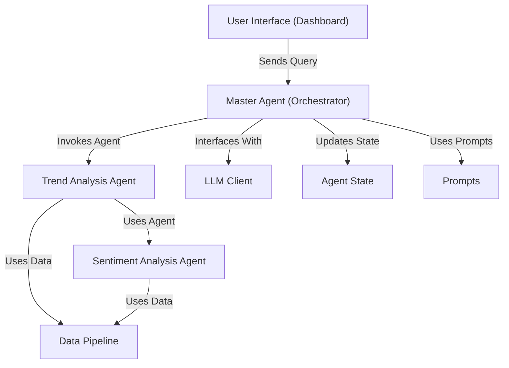

# Tutorial: EggHatch-AI

EggHatch-AI is an AI assistant focused on **PC building** and *tech gear shopping*.
It leverages a **Large Language Model (LLM)** to understand user queries and orchestrates
specialized agents to analyze *tech product reviews* for **trends** and **sentiment**,
providing **data-backed recommendations**.

**Source Repository:** [https://github.com/AustinZ21/EggHatch-AI](https://github.com/AustinZ21/EggHatch-AI)

## Chapters

1. [User Interface (Dashboard)]({{ site.baseurl }}/01_user_interface__dashboard__.html)
2. [Master Agent (Orchestrator)]({{ site.baseurl }}/02_master_agent__orchestrator__.html)
3. [LLM Client]({{ site.baseurl }}/03_llm_client_.html)
4. [Data Pipeline]({{ site.baseurl }}/04_data_pipeline_.html)
5. [Sentiment Analysis Agent]({{ site.baseurl }}/05_sentiment_analysis_agent_.html)
6. [Trend Analysis Agent]({{ site.baseurl }}/06_trend_analysis_agent_.html)
7. [Agent State]({{ site.baseurl }}/07_agent_state_.html)
8. [Prompts]({{ site.baseurl }}/08_prompts_.html)

---

Generated by [AI Codebase Knowledge Builder](https://github.com/The-Pocket/Tutorial-Codebase-Knowledge)