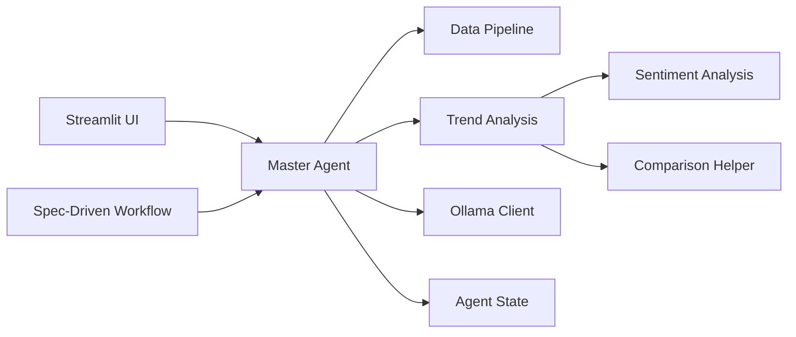

EggHatch-AI is an open-source AI shopping agent prototype for PC building and gaming laptop recommendations. It combines conversational intent understanding, review analysis, deterministic comparison logic, and local LLM synthesis into a small but thoughtfully structured demo.

This tutorial focuses on the current codebase shape:

- the Streamlit dashboard and multi-turn chat loop
- the master agent orchestration flow
- the data and NLP pipeline behind recommendations
- the new explainable laptop comparison flow
- the repo's new spec-driven development workflow

**Source Repository:** [AustinZ21/EggHatch-AI](https://github.com/AustinZ21/EggHatch-AI)

## What Changed Recently

- EggHatch-AI now supports **structured laptop comparison rationale** for explicit comparison queries.
- Comparison output is now rendered in the dashboard instead of living only in the generated response text.
- The repository now includes a **spec-driven scaffold** (`.specify/`, `.agents/skills/`, `AGENTS.md`) for structured iteration.
- `graphify-out/` artifacts are being used to map the project structure as the codebase evolves.

## Recommended Reading Path

If you want the fastest mental model, read in this order:

1. Master Agent
2. Trend Analysis
3. Explainable Comparison
4. Agent State
5. Prompts
6. Spec-Driven Workflow

## Chapters

  <a class="chapter-card" href="{{ site.baseurl }}/01_user_interface__dashboard__.html">
    01
    User Interface
    How the Streamlit dashboard captures queries, streams answers, and now displays comparison breakdowns.
  </a>
  <a class="chapter-card" href="{{ site.baseurl }}/02_master_agent__orchestrator__.html">
    02
    Master Agent
    The orchestrator that interprets user intent, runs analysis tasks, and synthesizes the final answer.
  </a>
  <a class="chapter-card" href="{{ site.baseurl }}/03_llm_client_.html">
    03
    LLM Client
    How EggHatch-AI talks to a local Ollama model and handles generation requests.
  </a>
  <a class="chapter-card" href="{{ site.baseurl }}/04_data_pipeline_.html">
    04
    Data Pipeline
    Fixture loading, preprocessing, and feature engineering for recommendation logic.
  </a>
  <a class="chapter-card" href="{{ site.baseurl }}/05_sentiment_analysis_agent_.html">
    05
    Sentiment Analysis
    How the project turns raw review text into positive, neutral, and negative signals.
  </a>
  <a class="chapter-card" href="{{ site.baseurl }}/06_trend_analysis_agent_.html">
    06
    Trend Analysis
    Topic modeling, feature signals, top candidates, and the comparison payload that now sits on top.
  </a>
  <a class="chapter-card" href="{{ site.baseurl }}/07_agent_state_.html">
    07
    Agent State
    The shared state object that lets each step add context without losing the thread.
  </a>
  <a class="chapter-card" href="{{ site.baseurl }}/08_prompts_.html">
    08
    Prompts
    The prompt layer that turns structured analysis into constrained recommendation responses.
  </a>
  <a class="chapter-card" href="{{ site.baseurl }}/09_explainable_comparison_.html">
    09
    Explainable Comparison
    The newest feature: deterministic scoring, tradeoffs, and recommendation rationale for laptop comparisons.
  </a>
  <a class="chapter-card" href="{{ site.baseurl }}/10_spec_driven_workflow_.html">
    10
    Spec-Driven Workflow
    How `.specify/` and Codex skills now shape feature design, planning, tasks, and implementation.
  </a>

